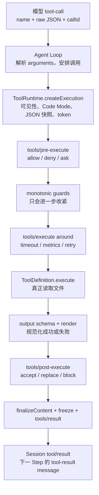
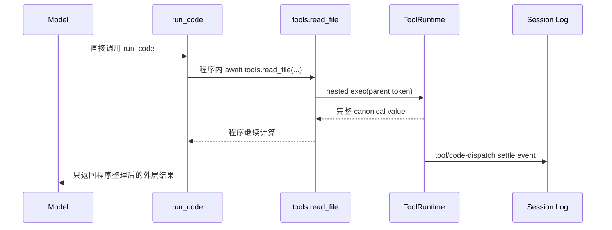

# 06. 工具执行管线

> 本章证据基线：DeepSeek Harness 固定提交 `47f943859bef60e4160492346772ded9b24f765a`。正文明确区分源码事实、设计解读和教学推演。

## 0. 本章学习目标

学完本章，你应该能够：

1. 从模型生成的 `tool-call` 追到 `ToolRuntime.execute()` 的最终冻结结果。
2. 解释 `ToolDefinition` 为什么同时声明参数、执行、输出和呈现契约。
3. 区分 pre、guard、around、body、post、finalize 六个阶段的责任。
4. 说清工具被拒绝、调用者取消、工具抛错和输出不合法时的不同结果。
5. 判断一个工具调用是否能并行，并解释为什么默认必须 fail closed。
6. 解释 Code Mode 中模型直接调用与程序嵌套调用为何不能混为一谈。

## 1. 一句话讲明白

**一句话直觉：模型只提交一份“不可信的调用申请”，`ToolRuntime` 把它经过快照、可见性、授权、包装执行、输出校验和结果冻结后，才变成能进入 Session 的工具事实。**

本章中央问题是：

> 当模型要求读取 `/workspace/package.json` 时，系统如何确保“参数合法、当前 Agent 有权调用、取消能生效、结果可序列化、日志与 UI 看到同一事实”？

上一章停在一个完整 `tool-call` block：

```json
{"id":"call_7","name":"read_file","arguments":"{\"path\":\"package.json\"}"}
```

注意：它只是模型输出的字符串，不是可信函数调用。

## 2. 最直觉的方案为什么不够

最直觉的实现是：

```ts
// 教学反例
const tool = tools[call.name]
const args = JSON.parse(call.arguments)
const result = await tool(args)
messages.push({ role: 'tool', result })
```

这个版本适合十分钟 Demo，却同时遗漏：

- 当前 Agent 是否看得见该工具；
- 参数对象在异步执行期间会不会被调用方继续修改；
- 读取文件是否需要审批；
- 超时与用户取消如何进入底层 I/O；
- 工具抛出普通 Error 时怎样转成模型可读结果；
- `Date`、`BigInt`、循环引用能否进入持久化日志；
- UI 应显示普通文本、文件预览还是 diff；
- 同一模型返回多个调用时哪些可以并行。

Harness 的答案不是把所有逻辑塞进 `read_file`，而是建立一条共享执行管线。

## 3. 先看地图：一份调用申请怎样落地



读图结论：**工具实现只占中间一格；安全、生命周期和可重建性由前后共享阶段共同保证。**

### 3.1 边界表

| 层 | 负责 | 不负责 |
| --- | --- | --- |
| Agent Loop | 从 assistant message 提取调用、调度多个 call、记录事件 | 不直接运行文件系统函数 |
| Tool Registry | 解析当前 scope 可见性，拥有执行身份和统一管线 | 不决定具体 read 的业务结果 |
| Policy / Wrapper 插件 | 审批、超时、指标、结果策略 | 不伪造工具身份 |
| Tool Definition | 领域动作、canonical value、render | 不自行复制全局审批框架 |
| Session | 记录调用和结果，推导下一轮消息 | 不重新执行工具以恢复结果 |

读表结论：**横切规则归管线，领域动作归工具，持久化归 Session；三者混写会让每个工具都出现不同安全语义。**

## 4. 最小正确机制

剥掉审批 UI、Code Mode 和呈现卡片后，最小机制如下：

```ts
// 教学伪代码
async function execute(input, callerSignal) {
  const exec = createIdentityAndSnapshot(input, callerSignal)
  const pre = await waterfall('tools/pre-execute', exec, allow)
  if (pre !== 'allow') return materializeDenied(pre)

  const raw = await waterfall('tools/execute', exec, async () => {
    const definition = resolveVisibleTool(exec.name, exec.agent)
    const value = await definition.execute(exec.arguments, exec)
    validate(definition.output.schema, value)
    return renderCanonicalResult(definition, value)
  })

  const post = await waterfall('tools/post-execute', exec, raw, accept)
  return deepFreeze(materialize(post))
}
```

最小内核只有三条不变量：

1. **身份与参数先冻结。** 后续插件只能处理 Registry 铸造的 execution。
2. **策略围绕执行，而不是藏在执行里。** pre 可阻止，around 可包装，post 可审查结果。
3. **所有出口都物化。** 成功、拒绝、抛错和取消最终都成为同一种 `ToolExecutionResult`。

## 5. 读源码前需要的类型

### 5.1 `ToolDefinition` 的四个面

`ToolDefinition` 不是 `args => Promise<string>`。它包含：

- **模型面：** name、description、parameters；
- **执行面：** `execute(args, exec)`；
- **规范值面：** `output.schema`；
- **投影面：** `output.render`、可选 `presentationMeta` 与 `finalizeContent`。

源码接口见 [`packages/core/tools/src/index.ts:211-269`](https://github.com/deepseek-ai/deepseek-harness/blob/47f943859bef60e4160492346772ded9b24f765a/packages/core/tools/src/index.ts#L211-L269)。

**容易误读的细节：** `timeoutMs` 虽然挂在 `ToolDefinition` 上，却不会自动产生超时，也不会发给模型。注释明确说它由 `dsh-tool-call-timeout-policy` 的 `tools/execute` wrapper 执行。看到字段名就断言“Registry 内置超时”是错误的。

真正的 timeout 插件读取当前 scope 下定义的 `timeoutMs`，临时替换 `exec.signal`，等待 `next()` 达到静止点，再只在自己的 deadline 获胜时替换为 `TOOL_TIMEOUT` 结果，见 [`packages/guard/timeout-policy/src/index.ts:50-80`](https://github.com/deepseek-ai/deepseek-harness/blob/47f943859bef60e4160492346772ded9b24f765a/packages/guard/timeout-policy/src/index.ts#L50-L80)。

### 5.2 `ToolExecutionResult` 是成功与失败的联合

最终结果不是靠 throw 表达一切。执行管线会把工具错误转成 `isError` 结果，并尽量保留稳定 error info。相关类型与错误类位于 [`packages/core/tools/src/index.ts:494-519`](https://github.com/deepseek-ai/deepseek-harness/blob/47f943859bef60e4160492346772ded9b24f765a/packages/core/tools/src/index.ts#L494-L519) 和 [`index.ts:580-607`](https://github.com/deepseek-ai/deepseek-harness/blob/47f943859bef60e4160492346772ded9b24f765a/packages/core/tools/src/index.ts#L580-L607)。

### 5.3 execution token 是能力，不是普通 id

`createExecution()` 由 Registry 生成 token、callId、rootCallId、agent、parent、signal，并提供 `deferContext()` 与 `concludeTurn()`。

模型只能给 call id 和工具名，不能伪造内部 token。源码见 [`packages/core/tools/src/index.ts:1364-1397`](https://github.com/deepseek-ai/deepseek-harness/blob/47f943859bef60e4160492346772ded9b24f765a/packages/core/tools/src/index.ts#L1364-L1397)。

第一方工具通常通过 `defineTool()` 把参数 spec 编译成 JSON Schema；包装后的 `execute()` 会先运行校验，违规时抛 `ToolArgsError`，调用方定义的 body 因而只收到已验证参数，见 [`packages/core/tools/src/schema.ts:538-588`](https://github.com/deepseek-ai/deepseek-harness/blob/47f943859bef60e4160492346772ded9b24f765a/packages/core/tools/src/schema.ts#L538-L588)。

## 6. 一次真实源码旅程：读取 `package.json`

本章始终使用同一场景：模型希望读取工作区 `package.json`，随后告诉用户包名。

### 第 1 站：Agent Loop 识别完整工具调用

上一章的 `BlockAssembler` 已得到完整 `ToolCallBlock`。Agent Loop 筛出所有 `type === 'tool-call'` 的 block，交给 `executeToolCalls()`；没有 tool call 才直接结束 Turn。

**输入：** assistant message 中的 `{ id, name, arguments }`。

**输出：** 一组待执行调用与后续 tool result。

**状态变化：** assistant message 已经持久化，工具结果尚未产生。

入口见 [`packages/core/agent-loop/src/agent.ts:373-399`](https://github.com/deepseek-ai/deepseek-harness/blob/47f943859bef60e4160492346772ded9b24f765a/packages/core/agent-loop/src/agent.ts#L373-L399)。

### 第 2 站：Registry 先解析可见性与呈现模式

`resolveExecution(name, scope, nested)` 先从当前 Agent scope 的 registry view 找工具。若 scope 是 Code Mode，模型直接调用除 `run_code` 外的名称会被 collapse；带 parent token 的嵌套 SDK 调用才可访问其他可见工具。

**输入：** `read_file`、agent scope、是否有 parent。

**输出：** 当前执行可用的 `ToolDefinition` 或 undefined。

**状态变化：** 还未进入可扩展 policy，因此一个注定被 Code Mode 拒绝的直调不会被审批插件“救活”。

源码见 [`packages/core/tools/src/index.ts:1208-1225`](https://github.com/deepseek-ai/deepseek-harness/blob/47f943859bef60e4160492346772ded9b24f765a/packages/core/tools/src/index.ts#L1208-L1225) 与 [`index.ts:1308-1326`](https://github.com/deepseek-ai/deepseek-harness/blob/47f943859bef60e4160492346772ded9b24f765a/packages/core/tools/src/index.ts#L1308-L1326)。

### 第 3 站：参数先做 lossless JSON 快照

模型参数从 raw JSON 解析后仍是普通对象。`createExecution()` 通过 `snapshotJsonValue()` 建立 detached copy，再 `deepFreeze`。无法无损表示为 JSON 的值直接成为 final error，不进入工具 body。

**输入：** `{ path: 'package.json' }`。

**输出：** 与调用者脱离、不可变的 `exec.arguments`。

**状态变化：** 后续插件与工具读取的是同一份参数事实。

源码见 [`packages/core/tools/src/index.ts:1398-1449`](https://github.com/deepseek-ai/deepseek-harness/blob/47f943859bef60e4160492346772ded9b24f765a/packages/core/tools/src/index.ts#L1398-L1449)。

### 第 4 站：`tools/pre-execute` 决定 allow、deny 或 ask

对于读文件，部署策略可能直接 allow；对于写系统目录，则可能 ask。Waterfall 默认 allow。若返回 ask，Registry 通过可选 approval service 解析；没有审批服务时不能把 ask 当作 allow。

然后 monotonic guard 还能进一步拒绝。guard 的意义是：扩展策略可以收紧，但不能在后续插件中复活已禁止的调用。

**输入：** Registry 铸造的 exec。

**输出：** dispatch、post-result 或 final-result 三种调度阶段。

**状态变化：** deny 会物化为 `Error: reason`，bodyInvoked 仍为 false。

真实分支见 [`packages/core/tools/src/index.ts:1453-1506`](https://github.com/deepseek-ai/deepseek-harness/blob/47f943859bef60e4160492346772ded9b24f765a/packages/core/tools/src/index.ts#L1453-L1506)。

### 第 5 站：around wrapper 包裹真正工具 body

allow 后进入 `tools/execute` Waterfall。timeout、metrics 或 retry listener 可以在调用 `next()` 前后工作，也可以短路返回一个规范结果。

但 wrapper 只能替换 `exec.signal`，不能替换 call identity。Registry 在 body 前会把原始 caller signal 与 wrapper signal 重新 fuse，防止 wrapper 意外或恶意切断用户取消。

**输入：** allowed exec。

**输出：** normalized candidate result。

**状态变化：** 只有进入 definition.execute 前，`bodyInvoked` 才设为 true。

源码见 [`packages/core/tools/src/index.ts:1527-1559`](https://github.com/deepseek-ai/deepseek-harness/blob/47f943859bef60e4160492346772ded9b24f765a/packages/core/tools/src/index.ts#L1527-L1559) 与 [`index.ts:1562-1598`](https://github.com/deepseek-ai/deepseek-harness/blob/47f943859bef60e4160492346772ded9b24f765a/packages/core/tools/src/index.ts#L1562-L1598)。

### 第 6 站：`read_file.execute` 做唯一的领域动作

此时工具才读取文件。它应把 `exec.signal` 继续传给底层 I/O，并返回 output schema 允许的 canonical JSON value，而不是直接构造任意 UI card。

**教学推演：** 对本章场景，canonical value 可以是：

```json
{
  "path": "/workspace/package.json",
  "content": "{ ... }",
  "lineCount": 42
}
```

数据变化是：不可信参数申请已经变为受 signal 约束的领域结果；但结果还没有通过 output schema 与 render 检查，因此仍不能落账。

源码中的文件读取工具正是这样实现：它声明 `isConcurrencySafe: () => true`，解析参数后解析 regular-file target，并把 `exec.signal` 传给 `streamText` 或 `readText`，见 [`packages/fs/tool-fs/src/read.ts:134-150`](https://github.com/deepseek-ai/deepseek-harness/blob/47f943859bef60e4160492346772ded9b24f765a/packages/fs/tool-fs/src/read.ts#L134-L150)。这里的并发安全不是因为工具名叫 read，而是实现还用版本检查保护后续 guarded mutation；不能从“只读”标签机械推断所有实现都可并行。

### 第 7 站：canonical value 先校验，再投影为模型内容

Registry 验证 value 是 lossless JSON 且符合 `output.schema`，随后调用 `output.render(args, value)` 生成 `ContentBlock[]`。呈现元数据是另一种纯投影，只用于顶层调用。

如果工具返回 `BigInt`、schema 不匹配，或 renderer 抛错，会变成 `ToolOutputError`，而不是伪造成功。

创建与验证成功结果的实现集中在 [`packages/core/tools/src/index.ts:1760-1817`](https://github.com/deepseek-ai/deepseek-harness/blob/47f943859bef60e4160492346772ded9b24f765a/packages/core/tools/src/index.ts#L1760-L1817)。

### 第 8 站：post policy 可以接受、替换或阻断

`tools/post-execute` 能检查已经规范化的结果。例如敏感文件策略可在工具读完后发现输出包含 secret，返回 block；也可用安全摘要替换 content。

限制是：失败结果不能被随意替换 value 变成成功，accept decision 也不能同时替换 canonical value 与 content，避免两个投影互相矛盾。

**输入：** exec 与只读 result。

**输出：** 最终候选结果。

**状态变化：** block 会成为 valueless failure；accept replacement 仍要重新校验。

post 阶段见 [`packages/core/tools/src/index.ts:1729-1778`](https://github.com/deepseek-ai/deepseek-harness/blob/47f943859bef60e4160492346772ded9b24f765a/packages/core/tools/src/index.ts#L1729-L1778)。

### 第 9 站：最后一次内容收口与冻结通知

`finishScheduledExecution()` 先物化 candidate，再运行 definition-own 的 `finalizeContent`，再物化一次，最后发 `tools/result`。listener failure 被 contained，不能改变返回给调用方的权威结果。

**输入：** post 后 candidate。

**输出：** lossless、deep-frozen `ToolExecutionResult`。

**状态变化：** 从此 UI、Session 与 observer 读取同一份不可变结果。

源码见 [`packages/core/tools/src/index.ts:1601-1659`](https://github.com/deepseek-ai/deepseek-harness/blob/47f943859bef60e4160492346772ded9b24f765a/packages/core/tools/src/index.ts#L1601-L1659)。

## 7. 状态不是一条直线

```text
input
 ├─ 参数不可快照 / Code Mode 直调拒绝 ──> final-result
 └─ ready
     ├─ caller 已取消 ──> final-result(ABORTED_BEFORE_DISPATCH)
     └─ pre
         ├─ deny / guard ──> post-result(error)
         ├─ policy 抛错 ──> final-result(error)
         └─ dispatch
             ├─ wrapper 失败 ──> final-result(error)
             └─ body outcome ──> post-result
                    └─ post / finalize / freeze / notify
```

读图结论：**不是所有失败都会走 post；pipeline 自身失败直接 final，而正常拒绝和工具 body 结果仍可被 post 审查。**

### 7.1 取消结果取决于 body 是否开始

如果取消发生在工具 body 前，结果码是 `ABORTED_BEFORE_DISPATCH`；body 已开始后取消，则是 `ABORTED`。Registry 不会 abandon 已开始 Promise，而是等待工具达到 quiescence，再决定最终结果。

这避免同进程工具虽然 UI 已显示停止，后台仍在写文件的“幽灵工作”。取消选择见 [`packages/core/tools/src/index.ts:1517-1524`](https://github.com/deepseek-ai/deepseek-harness/blob/47f943859bef60e4160492346772ded9b24f765a/packages/core/tools/src/index.ts#L1517-L1524)。

### 7.2 thrown tool 不是 thrown pipeline

工具 body 抛错会在 `dispatchToolBody()` 内被捕获并转成 error result，因此仍进入 post。若 `tools/execute` listener 自己抛错，dispatch stage 返回 final-result，不再经过 post。

**容易误读的细节：** “任何工具相关错误都走 post”不成立；条件是错误已被 body 边界规范化为工具结果。

## 8. 并发：为什么默认是 exclusive

模型一次可以产出多个 tool call。最直觉的方案是 `Promise.all`，但两个写文件工具可能互相覆盖，一个读与一个写也可能看到不一致中间态。

Harness 让定义通过 `isConcurrencySafe(args)` 对每次参数做纯分类：只有返回严格 `true` 才 parallel；缺失、抛错、返回非 true、工具不可见都 exclusive。

实现见 [`packages/core/tools/src/index.ts:1269-1284`](https://github.com/deepseek-ai/deepseek-harness/blob/47f943859bef60e4160492346772ded9b24f765a/packages/core/tools/src/index.ts#L1269-L1284)。

| `read_file` 场景 | 建议分类 | 原因 |
| --- | --- | --- |
| 读取两个普通文件 | parallel | 无父状态修改，结果相互独立 |
| 读取同时更新共享 cursor | exclusive | 共享可变状态不满足交换性 |
| classifier 抛错 | exclusive | 无法证明安全就 fail closed |
| 未声明 classifier | exclusive | 并发是显式能力，不是默认优化 |

读表结论：**并发不是性能开关，而是工具作者对共享状态作出的可验证声明。**

## 9. Code Mode：同一工具为何有两种调用身份

在 native 模式中，模型可以直接调用 `read_file`。在 code 模式中，模型面只暴露 `run_code`；程序通过生成的 SDK 再嵌套调用 `read_file`。



读图结论：**模型历史只接收外层精选结果，但日志仍记录每个子调用，运行效率与审计性不必二选一。**

`code-mode.ts` 的模块注释直接说明子调用遵循原生并发契约、逐个记录，而只有外层 curated result 进入模型历史，见 [`packages/core/tools/src/code-mode.ts:1-16`](https://github.com/deepseek-ai/deepseek-harness/blob/47f943859bef60e4160492346772ded9b24f765a/packages/core/tools/src/code-mode.ts#L1-L16)。

`tools/code-dispatch-log` 只允许替换 durable log copy：程序已经收到完整值，模型也看不到子调用内容。监听器抛错时退回原内容，不能让 settle event 消失，见 [`packages/core/tools/src/index.ts:175-189`](https://github.com/deepseek-ai/deepseek-harness/blob/47f943859bef60e4160492346772ded9b24f765a/packages/core/tools/src/index.ts#L175-L189) 与 [`index.ts:1287-1305`](https://github.com/deepseek-ai/deepseek-harness/blob/47f943859bef60e4160492346772ded9b24f765a/packages/core/tools/src/index.ts#L1287-L1305)。

## 10. Java 类比与边界

可以把管线局部类比成 Spring MVC：

| Harness | Java 近似物 |
| --- | --- |
| 参数 schema / snapshot | DTO bind + Bean Validation |
| pre-execute | AuthorizationManager / interceptor preHandle |
| tools/execute | Around advice / filter chain |
| ToolDefinition.execute | Controller 或 application service |
| post-execute | response advice / DLP filter |
| output.render | DTO 到 response representation |

读表结论：**类比帮助识别横切关注点，但 Harness 的结果还要进入模型上下文和事件日志，而不是只返回 HTTP client。**

类比失效的地方：

- Waterfall listener 可以短路并返回结果，不只是观察；
- 工具调用身份包含模型 callId、rootCallId 与 parent token；
- 工具输出同时有 canonical JSON value、模型 content 与 UI presentation；
- 取消是 cooperative，Registry 无法硬杀同进程 JavaScript。

## 11. DeepSeek Harness 的选择与取舍

| 问题 | 最直觉方案 | Harness 选择 | 取舍 |
| --- | --- | --- | --- |
| 权限 | 每个工具自己 if | pre + guard | 规则集中，但需理解阶段顺序 |
| 超时 | body 内各写 timer | around wrapper + signal fuse | 复用策略，但工具仍必须协作取消 |
| 输出 | 直接返回字符串 | canonical value + schema + render | 多一层定义，换来重放与多呈现 |
| 错误 | 全部 throw | 统一 materialized result | 模型能自修复，但要维护错误分类 |
| 并发 | 全部 Promise.all | per-call fail-closed classifier | 保守但安全 |
| Code Mode | 子调用不记录 | parent token + dispatch log | 审计完整，事件模型更复杂 |

读表结论：**Harness 把“工具函数”提升为一种受策略、生命周期和持久化约束的协议。**

## 12. 可以带走的方法

### 方法一：先规范值，再做多种投影

让工具先返回 canonical JSON value，再投影为模型文本和 UI metadata。不要让 UI 文本成为唯一事实。

验证问题：换一个 renderer 后，能否不重新执行工具就重建展示？

### 方法二：横切策略围绕统一 seam

授权在 body 前，超时包裹 body，DLP 在结果后。新增策略不应修改所有工具。

验证问题：增加“所有写文件都需审批”的规则时，要改几个工具实现？理想答案是零。

### 方法三：并发必须用负担得起的证明

默认 exclusive，只让纯读取或明确支持并发的参数形态 opt in。

验证问题：两个并行调用交换顺序后，最终状态和各自结果是否保持等价？

## 13. 失败与安全边界清单

1. **工具不可见：** `UNKNOWN_TOOL`，不执行 body。
2. **Code Mode 直调其他工具：** 在 policy 前确定性拒绝，并告诉模型改走 `run_code`。
3. **参数无法无损快照：** final error，不把不稳定对象交给插件。
4. **pre deny / ask 无审批支持：** 物化拒绝，不能默许。
5. **调用者在 body 前取消：** `ABORTED_BEFORE_DISPATCH`。
6. **body 已开始后取消：** 等待 quiescence，再物化 `ABORTED`。
7. **工具抛错：** 归一为 isError，并仍可进入 post。
8. **output schema 或 renderer 失败：** `INVALID_TOOL_OUTPUT`，不伪造成功。
9. **post block：** 变成有反馈的 failure。
10. **result observer 失败：** contained，不篡改权威结果。

## 14. 常见误区

1. `timeoutMs` 是声明，不是 Registry 自动计时器；必须挂载策略插件。
2. `isConcurrencySafe` 返回 truthy 字符串不算安全，只有严格 `true`。
3. `tools/post-execute` 不是所有异常的 finally；pipeline listener 失败可直接 final。
4. Code Mode 下 `read_file` 不是未注册，只是模型直调被 presentation collapse 拒绝。
5. `tools/code-dispatch-log` 改的是日志副本，不会改程序已收到的子调用值。

## 15. 费曼自测

1. 模型输出的 `callId` 为什么不能当作 Registry execution token？
2. pre deny 与 body throw 在后续阶段上有什么差异？
3. around wrapper 替换 signal 后，Registry 为什么还要把 caller signal fuse 回去？
4. canonical value、模型 content、presentation metadata 三者分别解决什么问题？
5. Code Mode 中为什么模型只能直调 `run_code`，而程序又能调用 `read_file`？

复述标准：不用源码名也能先讲清“申请—授权—执行—校验—落账”，再用 `createExecution`、三段 Waterfall 和 materialization 对上真实标识符。

## 16. 三级练习

### Level 1：只读定位

为 `read_file` 调用找出：参数快照、pre 默认 allow、caller signal fuse、工具 body 调用、post 默认 accept、最终 freeze/notify 六个位置。

验收：每个位置说明输入、输出和 bodyInvoked 是否已经变为 true。

### Level 2：策略设计

设计一条策略：读取普通项目文件直接 allow；读取 `.env` 必须 ask；读取 `.git/credentials` 永远 deny；输出中若匹配 API key 则 post block。

验收：明确每条规则挂在 pre、guard 还是 post，并解释为什么不放进 `read_file.execute`。

### Level 3：小型实现

实现一个 `weather` 工具：

- 参数为 city 与 unit；
- canonical value 包含温度、单位和 observedAt；
- output schema 拒绝非法值；
- render 生成模型可读文本；
- 只读调用声明可并行；
- timeout policy 通过 `exec.signal` 取消模拟网络；
- 测试 deny、timeout、bad output 与两个并发调用。

验收：任何失败都得到冻结的结构化结果，并且策略代码不进入工具 body。

## 17. 小结与下一章钩子

本章把一段模型 JSON 变成了可审计执行：Registry 铸造身份并快照参数，pre/guard 决定能否开始，around 控制执行边界，output/post/finalize 把结果收敛为唯一冻结事实。最关键的转变是：**工具不再是一个函数，而是一个受协议管理的能力。**

`read_file` 成功后，结果会进入下一 Step。但模型下一次究竟看到哪些 system sections、哪些历史消息、哪些工具 schema，以及这次读取产生的动态上下文？下一章打开 Prompt 与上下文装配黑盒。
