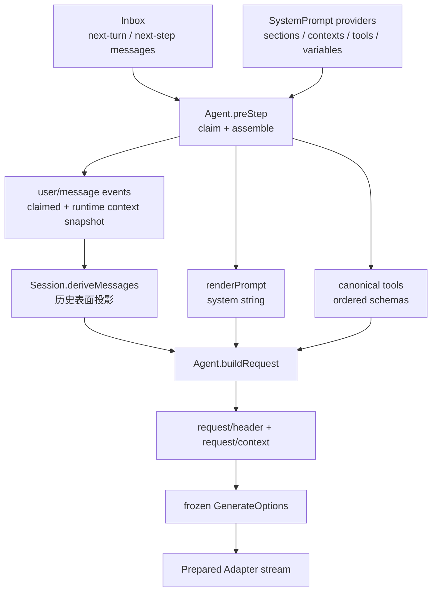

# 07. Prompt 与上下文

> 本章证据基线：DeepSeek Harness 固定提交 `47f943859bef60e4160492346772ded9b24f765a`。文中会标明源码事实、设计解读和教学推演。

## 0. 本章学习目标

学完本章，你应该能够：

1. 区分 system section、runtime context、Session 历史消息与工具 schema。
2. 画出一个 Step 从 Inbox claim 到 frozen LLM request 的完整装配链。
3. 解释 section 的 name、order、scope、complete 与 disposer 各解决什么问题。
4. 说明动态 context 为什么要物化为 user-role snapshot，而不是永远重算。
5. 证明工具注册顺序不会泄漏到 request/header 与 Provider 请求。
6. 识别未知变量、无效 toolOrder、pre-step reject 与取消四类停止边界。

## 1. 一句话讲明白

**一句话直觉：每个 Step 都重新收集当前作用域的 Prompt 片段、动态上下文和工具 schema，再与 Session 已记录的消息合并成冻结请求；实际发送的 header 与 context 会进入事件日志，使恢复不依赖重新猜测当时环境。**

本章中央问题是：

> `read_file` 已返回 `package.json` 内容后，下一次模型调用究竟看到什么，系统又怎样证明“它看到的正是这些”？

上一章的黑盒是“工具结果会进入下一 Step”。但模型输入绝不只有工具结果：Persona、Harness 身份、Workspace 位置、动态环境、可用工具及历史消息都要在同一个边界汇合。

## 2. 最直觉的方案为什么不够

最直觉的方案是维护一个全局字符串：

```ts
// 教学反例
let system = BASE_PROMPT
system += workspaceInstructions
system += toolDescriptions
const response = await model({ system, messages })
```

生产场景会立刻遇到问题：

- 多插件同时追加时，谁先谁后依赖加载时序；
- 子 Agent 需要不同 Persona，却共享同一字符串；
- HMR 卸载插件后，旧片段可能残留；
- 当前时间或工作区状态是每 Step 重算，恢复时已经不同；
- 工具 schema 与 system 中的工具指导可能排序不一致；
- 日志只保存“生成规则”，无法证明当时实际值。

Harness 不把 Prompt 当作字符串变量，而把它拆成**可注册的 provider、一次装配的 assembly 和可持久化的请求事实**。

## 3. 先画四层地图



读图结论：**Prompt 装配不是“拼 system 字符串”，而是 Inbox、Provider registry、Session 投影与请求落账在 Step 边界的一次会合。**

### 3.1 四类模型输入不要混淆

| 输入 | 角色 | 是否进入消息历史 | 典型内容 |
| --- | --- | --- | --- |
| System sections | 稳定指令与能力说明 | 否，作为 `system` 字段 | Harness identity、Persona、工具指导 |
| Runtime contexts | 当时环境快照 | 是，物化为 user-role context | cwd、workspace 状态、动态提示 |
| Session messages | 已发生对话与工具结果 | 是 | 用户问题、assistant answer、tool-result |
| Tool schemas | 可调用能力合同 | 否，作为 `tools` 字段 | name、description、parameters |

读表结论：**四类内容都“被模型看到”，但持久化位置和生命周期不同；把它们统称 Prompt 会掩盖恢复边界。**

## 4. 最小机制：一次 Step 装配

```ts
// 教学伪代码
const claimed = inbox.claim(target, turn)
const assembly = await systemPrompt.assemble({ scope: agent, signal })

const runtimeSnapshot = renderContextSnapshot(assembly)
const enteringMessages = runtimeSnapshot
  ? [...claimed, asUserContext(runtimeSnapshot)]
  : claimed

for (const message of enteringMessages) {
  session.append('user/message', message)
}

const header = canonicalHeader({
  config: await resolveModel(),
  system: renderPrompt(assembly),
  tools: assembly.tools,
})
session.appendIfChanged('request/header', header)

return freeze({ ...header, messages: session.deriveMessages() })
```

这里的通用 Agent 内核是：**收集规则 → 物化动态值 → 合并历史 → 冻结一次请求**。

Harness 产品叠加层包括：Cordis scope、Waterfall、具名 section、toolOrder、Session event surface 和 HMR disposer。先掌握内核，再读这些机制如何让多插件协作可控。

## 5. 读源码前必须懂的概念

### 5.1 section、context 与 variable 是三种 provider

`PromptSection` 有 name、order、text 与可选 complete；`PromptContext` 也有 name、order、text，但它会进入动态上下文快照；variable 则用于严格插值 `{{name}}`。

类型见 [`packages/core/system-prompt/src/index.ts:41-120`](https://github.com/deepseek-ai/deepseek-harness/blob/47f943859bef60e4160492346772ded9b24f765a/packages/core/system-prompt/src/index.ts#L41-L120)。

### 5.2 scope 是可见性，不是字符串前缀

全局 provider 对所有 Agent 可见；匹配 Agent scope 的 provider 可贡献额外内容或以同名项 shadow 全局项。离 Agent 更近的 scope layer 胜出。

### 5.3 disposer 是 Prompt 生命周期的一部分

`section()`、`context()`、`tools()`、`variable()` 都返回 Cordis effect disposer。插件卸载时对应 provider 消失，并触发 `system-prompt/change`。

这意味着 HMR 后下一 Step 重新 assemble，不会继续使用已卸载插件的旧片段。

## 6. 一次真实源码旅程：读完 `package.json` 后继续回答

继续沿用前两章的场景。Step 1 中模型调用 `read_file`，工具结果已经排入 next-step。现在系统准备 Step 2，让模型提取包名。

### 第 1 站：Inbox claim 决定本 Step 拥有哪些新消息

`preStep()` 调用 `inbox.claim(target, turn)`。首 Step 从 `next-turn` claim；工具结果或 steer 等后续输入来自 `next-step`。

**输入：** next-step 中的 `tool-result` user message。

**输出：** 从 Inbox 移除并归属于当前 turn 的 claimed batch。

**状态变化：** claim 是消费，不是 peek；随后 reject 也不会自动把 batch 塞回去。

源码顺序见 [`packages/core/agent-loop/src/agent.ts:225-242`](https://github.com/deepseek-ai/deepseek-harness/blob/47f943859bef60e4160492346772ded9b24f765a/packages/core/agent-loop/src/agent.ts#L225-L242)。

### 第 2 站：`SystemPrompt.assemble()` 重新收集当前 providers

Agent 把自己的 scope 与当前 turn signal 传给 assembly。SystemPrompt 先收集全局变量，再按 scope chain 覆盖；具名 section 与 context 也按 scope 合并。

**输入：** `{ scope: agent, signal }`。

**输出：** sections、contexts、tools、variables 组成的 `PromptAssembly`。

**状态变化：** provider 函数此刻才求值，所以读取的是 Step 2 当前事实，而不是 Agent 创建时的缓存。

源码见 [`packages/core/system-prompt/src/index.ts:457-503`](https://github.com/deepseek-ai/deepseek-harness/blob/47f943859bef60e4160492346772ded9b24f765a/packages/core/system-prompt/src/index.ts#L457-L503)。

### 第 3 站：section 按 order 排序并解析 text

section definitions 按 order 升序；text 可以是静态字符串，也可以是每次 assembly 调用的函数。默认 Harness identity 是 -100，deployment Persona 是 0；工具指导通常处于 100–199。

**输入：** 当前 scope 下的 section definitions。

**输出：** 已解析但尚未变量插值的 `AssembledSection[]`。

**状态变化：** 同名 scoped section 已 shadow 全局项，顺序不再依赖插件加载先后。

内置 section 见 [`packages/core/system-prompt/src/index.ts:350-370`](https://github.com/deepseek-ai/deepseek-harness/blob/47f943859bef60e4160492346772ded9b24f765a/packages/core/system-prompt/src/index.ts#L350-L370)，注册约束见 [`index.ts:373-389`](https://github.com/deepseek-ai/deepseek-harness/blob/47f943859bef60e4160492346772ded9b24f765a/packages/core/system-prompt/src/index.ts#L373-L389)。

### 第 4 站：工具 schemas 收集后形成 canonical order

每个 tool provider 返回本次可见 schemas 和可选 knownNames。Assembler 会 structuredClone parameters，防止 provider 在装配后修改参数 schema。

若没有配置 `toolOrder`，按工具名的 code-unit 字典序排序；配置了 `<unlisted-tools>` 时，显式名称占固定位置，其余工具在 rest 位置排序插入。

**输入：** 当前 Agent 可见的 `read_file` 等工具 schema。

**输出：** 稳定顺序的 `assembly.tools`。

**状态变化：** 并发插件加载顺序被消除，不会进入 durable header。

排序规则见 [`packages/core/system-prompt/src/index.ts:139-182`](https://github.com/deepseek-ai/deepseek-harness/blob/47f943859bef60e4160492346772ded9b24f765a/packages/core/system-prompt/src/index.ts#L139-L182)，装配点见 [`index.ts:486-535`](https://github.com/deepseek-ai/deepseek-harness/blob/47f943859bef60e4160492346772ded9b24f765a/packages/core/system-prompt/src/index.ts#L486-L535)。

### 第 5 站：runtime context 物化为消息快照

`renderContextSections(assembly)` 先得到分节 context，再由 runtime context service 投影为一个 user message。默认 pre-step decision 把它追加到 claimed messages 之后。

对本章场景，Context 可能写明：

```text
<runtime-context>
cwd: /workspace/project
workspace: clean
</runtime-context>
```

**输入：** assembly.contexts 与 variables。

**输出：** 一个普通 `UserMessage` 或 undefined。

**状态变化：** “此刻 cwd 是什么”从生成规则变成即将进入 Session 的值。

真实调用见 [`packages/core/agent-loop/src/agent.ts:229-239`](https://github.com/deepseek-ai/deepseek-harness/blob/47f943859bef60e4160492346772ded9b24f765a/packages/core/agent-loop/src/agent.ts#L229-L239)。

### 第 6 站：`agent/pre-step` 可以进入或拒绝

Waterfall 收到完整 proposed messages，可返回 reject，也可改写 enter messages。返回 reject 时，Turn 以 blocked 结束，不产生 step/start，也不调用模型。

**输入：** claimed + runtime context messages、turn、step、signal。

**输出：** reject 或 enter。

**状态变化：** reject 不会把已 claim 的 batch 自动恢复；后来才插入 Inbox 的消息仍留待以后处理。

Turn 对 decision 的处理见 [`packages/core/agent-loop/src/agent.ts:245-284`](https://github.com/deepseek-ai/deepseek-harness/blob/47f943859bef60e4160492346772ded9b24f765a/packages/core/agent-loop/src/agent.ts#L245-L284)。

### 第 7 站：enter messages 先写 Session

Agent append `step/start` 后，把 decision.messages 逐条写成 `user/message`。本章场景中的 `tool-result` 与 runtime snapshot 此时都成为 durable surface 节点。

**输入：** pre-step 权威 messages。

**输出：** Session events。

**状态变化：** 即便稍后的 model request 失败，系统仍知道该 Step 当时认领了哪些输入。

### 第 8 站：Session 从事件表面推导历史

`deriveMessages()` 不扫描所有 raw event 后随便过滤，而是沿 surface nodes 投影消息。chunk、turn boundary 等没有 surface marker 的事件不会进入历史；compaction replace 会导致 cache rebuild。

**输入：** 当前 Session surface。

**输出：** 新数组，内部 Message 对象共享且 deep-frozen。

**状态变化：** `read_file` 的 tool result 成为模型历史的一部分，而原始 assistant/chunk 不重复进入。

源码见 [`packages/core/session/src/index.ts:701-746`](https://github.com/deepseek-ai/deepseek-harness/blob/47f943859bef60e4160492346772ded9b24f765a/packages/core/session/src/index.ts#L701-L746)。

### 第 9 站：system string 在 Step 内渲染

`step()` 对 assembly 调用 `renderPrompt()`，它做严格变量插值、丢弃空 section，并用空行连接。

**输入：** assembled sections 与 variables。

**输出：** Provider request 的 system string。

**状态变化：** 具名结构在最后一刻收敛成模型 API 接受的单字符串。

渲染规则见 [`packages/core/system-prompt/src/index.ts:204-217`](https://github.com/deepseek-ai/deepseek-harness/blob/47f943859bef60e4160492346772ded9b24f765a/packages/core/system-prompt/src/index.ts#L204-L217)，调用位置见 [`packages/core/agent-loop/src/agent.ts:332-345`](https://github.com/deepseek-ai/deepseek-harness/blob/47f943859bef60e4160492346772ded9b24f765a/packages/core/agent-loop/src/agent.ts#L332-L345)。

### 第 10 站：header 先落账，request 再从 header 构建

Agent Loop 准备模型配置后，将 config、adapter defaults、system、tools 组成 canonical header。首次、恢复或变化时 append `request/header`；Provider/model/contextWindow 变化时 append `request/context`。

随后 frozen request 直接读取 `header.config`、`header.system`、`header.tools`，messages 则来自 Step 边界的 `deriveMessages()`。

**输入：** assembly + Session history + Prepared Call。

**输出：** 可发送的 `GenerateOptions`。

**状态变化：** “日志声称发送的请求”和“Adapter 真正收到的请求”共享同一对象来源。

源码见 [`packages/core/agent-loop/src/agent.ts:458-494`](https://github.com/deepseek-ai/deepseek-harness/blob/47f943859bef60e4160492346772ded9b24f765a/packages/core/agent-loop/src/agent.ts#L458-L494)。

## 7. 一次 Step 的数据变化总表

| 时刻 | 本章场景中的数据 | 所有者 |
| --- | --- | --- |
| Inbox | tool-result user message | Agent Inbox |
| Assembly | sections、runtime context providers、read_file schema、variables | SystemPrompt |
| pre-step proposal | claimed tool-result + 当前 cwd snapshot | Agent / Waterfall |
| Session surface | 已 append 的 tool-result 与 context message | Session |
| Header | provider/model/system/ordered tools | Session request events |
| Frozen request | header 字段 + deriveMessages snapshot + signal | LLM 调用 |

读表结论：**每经过一层，动态或可变输入都会更接近不可变请求事实；最终 Adapter 不需要重新调用任何 Prompt provider。**

## 8. Section 机制的决定性分支

### 8.1 同名 section：shadow 与 duplicate 不同

同一 layer 重名是错误；scoped layer 与 global 同名则是合法 shadow。例如 Agent preset 用相同 `deployment:persona` 名称覆盖部署 Persona。

**设计解读：** name 是可替换槽位，order 是位置。只靠 order 无法表达“替换而非叠加”。

### 8.2 `complete: true` 不是最高优先级字符串

complete section 表示它是整个 system prompt。Assembler 仍会运行 cooperative Waterfall，以解析 tools、contexts、variables，但之后恢复该 complete section 为唯一 sections。

如果当前 scope 有两个 complete section，assembly 直接失败。实现见 [`packages/core/system-prompt/src/index.ts:504-539`](https://github.com/deepseek-ai/deepseek-harness/blob/47f943859bef60e4160492346772ded9b24f765a/packages/core/system-prompt/src/index.ts#L504-L539)。

**容易误读的细节：** `complete` 不等于“停止整个装配流程”。工具与 context 仍会收集，Waterfall 仍运行；只是在最终返回时锁定 system sections。

### 8.3 Harness source 与 cwd 明确分开

Boot 可添加 `harness:source` section，告诉模型实现源码 checkout 在哪里，同时明确它与任务 workspace 和当前工作目录不同，要求用 `pwd` 确认 cwd。

源码见 [`packages/boot/app-boot/src/index.ts:804-829`](https://github.com/deepseek-ai/deepseek-harness/blob/47f943859bef60e4160492346772ded9b24f765a/packages/boot/app-boot/src/index.ts#L804-L829)。

这是非常具体的 Prompt 安全设计：路径是能力提示，不是授权；源码 checkout 路径也不能推导 task cwd。

## 9. 工具顺序为何是请求事实

两个进程可能以不同顺序加载 `zulu`、`alpha`、`mike` 工具。如果直接保留 Map 插入顺序，同一配置会产生不同 request/header，缓存、重放与诊断都变得不稳定。

Harness 测试证明：

- 注册顺序 `zulu, alpha, mike` 会得到 `alpha, mike, zulu`；
- 不同注册顺序得到相同 header；
- 显式 toolOrder 同时作用于 header 和 Adapter request；
- toolOrder 引用未注册工具时，Turn 有 start/end，但没有 Step，也没有模型请求。

证据见 [`packages/core/agent-loop/tests/tool-order.spec.ts:67-109`](https://github.com/deepseek-ai/deepseek-harness/blob/47f943859bef60e4160492346772ded9b24f765a/packages/core/agent-loop/tests/tool-order.spec.ts#L67-L109)。

**设计解读：** 排序不是 UI 美观问题，而是重建协议的一部分。

## 10. 失败与停止边界

### 10.1 Prompt variable 失败

变量名必须匹配 `[a-z][a-z0-9_]*`。section 引用了未知或 undefined variable，渲染会失败；系统不会把 `{{secret}}` 原样漏给模型。

### 10.2 toolOrder 配置失败

重复名称、缺少 `<unlisted-tools>` 在配置解析时失败；引用未知注册工具在 assembly 时失败。此时本章场景不会向 Provider 发请求。

### 10.3 pre-step reject

已 claim 的 `tool-result` batch 被消费，Turn 以 blocked 结束，没有 Step。策略必须清楚这不是“稍后自动重试”的暂停按钮。

### 10.4 enter messages 为空

初始 Step 若被改写为空，仍保留 Turn 边界，但不花费模型调用。真实分支见 [`packages/core/agent-loop/src/agent.ts:271-277`](https://github.com/deepseek-ai/deepseek-harness/blob/47f943859bef60e4160492346772ded9b24f765a/packages/core/agent-loop/src/agent.ts#L271-L277)。

### 10.5 assembly 或 build 期间取消

scope provider 收到本次 assembly signal；Agent 在 await 之后反复 `throwIfAborted()`。signal 只控制当前装配，provider 不应保存它去取消未来 Turn。

### 10.6 request reconstruction 不一致

Agent-built request 被 deep-frozen，并带进程内 marker。`llm/stream` listener 只能读取，不能改写其消息。Prepared Call 还会再次验证 config 一致性。

## 11. Java 类比与边界

可以把 Prompt registry 类比为 Spring 中多个有序 `Bean` 贡献配置：

```java
List<PromptSectionProvider> providers;
providers.stream()
  .filter(p -> p.visibleTo(agentScope))
  .map(p -> p.resolve(stepContext))
  .sorted(comparingInt(Section::order));
```

runtime context 类似在请求进入 Controller 前把 request-scoped metadata 物化进 DTO；Session history 类似 event-sourced aggregate 的投影。

类比失效点：

- scope 可按 Agent 链 shadow 同名 provider，不只是 `@Order`；
- assembly Waterfall 可以权威改写结构；
- 动态 context 被写成模型历史，而不是只存在 ThreadLocal；
- request/header 是可重建事件，不只是 debug log。

## 12. DeepSeek Harness 的选择与取舍

| 问题 | 直觉方案 | Harness 选择 | 取舍 |
| --- | --- | --- | --- |
| Prompt 协作 | 共享字符串 append | 具名、有序、scoped section | 规则更多，但支持替换与卸载 |
| 动态环境 | 每次调用时临时拼接 | context provider → durable snapshot | 日志更长，但恢复不重算旧环境 |
| 工具顺序 | 注册顺序 | canonical order | 失去“先注册先显示”，换来确定性 |
| Persona 覆盖 | 再追加一段 | 同名 scoped shadow | 需管理稳定名称 |
| 全量 Prompt | 超大 order 覆盖 | `complete` 语义 | 强约束，避免多个全量来源混用 |
| 历史构建 | 扫 raw events | Session surface projection | 实现复杂，但 compaction 可重建 |

读表结论：**Harness 用显式结构换取多插件环境下的确定性与可恢复性。**

## 13. 可以带走的方法

### 方法一：组合前保留具名结构，最后才渲染字符串

section 在 registry 中保持 name、order、scope；只有发模型前才 join。

验证问题：卸载一个插件后，你能否精确移除它贡献的片段，而不是重新手工构造全局 Prompt？

### 方法二：保存动态值，不只保存生成规则

工作区扫描、时间、分支状态都可能变化。模型实际看到的 snapshot 应进入事件日志。

验证问题：一周后恢复 Session，系统能否解释旧 Step 当时看到的 cwd，而不是展示今天的 cwd？

### 方法三：消除基础设施加载顺序

插件注册顺序通常是并发启动产物，不应成为模型行为输入。对工具和 section 建立稳定排序与冲突规则。

验证问题：把插件加载顺序反转，request/header 是否仍字节稳定？

## 14. 常见误区

1. system Prompt、runtime context、历史 messages 和 tool schemas 不是同一个数组。
2. `complete: true` 只锁定 sections，不会跳过 tools/context 收集和 assembly Waterfall。
3. `request/context` 在 `buildRequest()` 中记录的是 Provider/model/contextWindow；动态 runtime context 则作为 user message 进入 Session，二者不要混名。
4. pre-step reject 会消费已 claim batch，不是自动重排队。
5. toolOrder 未配置也不是无序，而是 locale-independent 字典序。

## 15. 费曼自测

1. `package.json` 的工具结果、当前 cwd、Persona 和 `read_file` schema 分别进入 request 的哪个字段？
2. 为什么 runtime context 要在进入 Step 时写成 user message，而不是恢复时重新扫描？
3. section name 与 order 分别解决什么问题？只有 order 会缺少什么能力？
4. toolOrder 引用 `ghost` 时为什么会出现 Turn 边界却没有 Step 边界？
5. `complete` section 激活后，assembly Waterfall 和 tool providers 还会不会运行？

复述标准：你能用“registry assembly → context snapshot → session surface → canonical header → frozen request”讲完整条链，并指出每层的数据所有者。

## 16. 三级练习

### Level 1：只读定位

找出：

- Harness identity 与 Persona 的默认 order；
- scoped section shadow 的合并点；
- context 追加到 claimed messages 的位置；
- tool schema structuredClone 的位置；
- header append 后 request 从 header 取值的位置。

验收：每处说明“值何时求值”和“是否已持久化”。

### Level 2：请求手工装配

为本章场景画出 Step 2 的完整输入：

- sections：identity、source、persona、tool guidance；
- contexts：cwd 与 workspace status；
- messages：原问题、assistant tool-call、tool-result、runtime snapshot；
- tools：按 canonical order 排列。

验收：明确哪些进入 `request/header`，哪些进入 `user/message`，哪些只存在于 Provider request。

### Level 3：小型插件设计

设计一个“当前部署环境”插件：

- 以具名 context provider 注入 environment 与 region；
- 不向模型暴露 token、密码或完整环境变量；
- 支持 Agent scope 覆盖；
- 用 variable 在 Persona 中引用公开 region；
- disposer 后下一 Step 不再出现；
- 测试两个注册顺序得到相同 tools/header。

验收：恢复旧 Session 时，旧 snapshot 不会被新环境覆盖。

## 17. 小结与下一章钩子

本章把“Prompt”拆回了四种有不同生命周期的输入：system sections、runtime context、Session messages 与 tool schemas。每个 Step 重新装配当前规则，但动态值在进入模型前就物化进 Session；header 先落账，冻结请求再从它生成。

现在，即使模型请求和工具结果都能重建，仍有最后一个问题：**这些 Session events 先提交在内存，如果进程在 write-behind 窗口内崩溃，重启时怎样判断哪些是可信前缀、哪些是撕裂尾部？** 下一章进入持久化与恢复。
