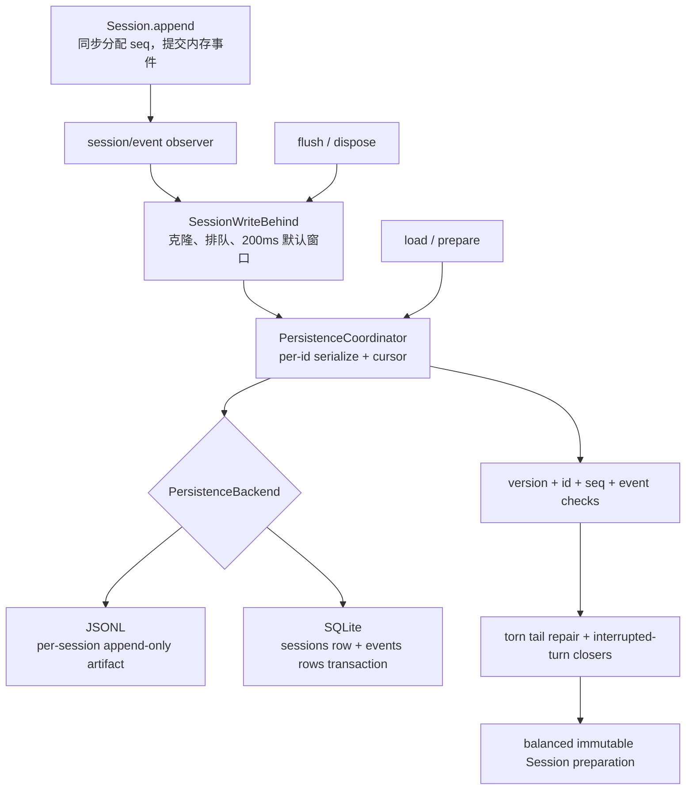

# 08. 持久化与恢复

> 本章证据基线：DeepSeek Harness 固定提交 `47f943859bef60e4160492346772ded9b24f765a`。文中“源码事实”来自固定链接；“设计解读”解释控制流；“教学推演”用于演练崩溃场景。

## 0. 本章学习目标

学完本章，你应该能够：

1. 区分 Session 内存提交、Persistence Coordinator 编排与 Backend 耐久写入。
2. 解释 write-behind 的 batch window、background failure retention 与 flush barrier。
3. 沿一次事件从 `Session.append()` 追到 JSONL 文件或 SQLite transaction。
4. 区分完整但未闭合的 Turn、撕裂尾记录、已提交区损坏和不支持的新格式。
5. 比较 JSONL 与 SQLite 在原子性、顺序读取、后缀查询和 raw artifact 上的取舍。
6. 设计 shutdown drain 与恢复校验，使“已完成”具有明确耐久边界。

## 1. 一句话讲明白

**一句话直觉：Session 先同步确认“事件已成为内存事实”，Persistence Coordinator 再按会话有序批写；`flush()` 和 shutdown drain 才把这个事实提升为耐久承诺，恢复时只接受连续、版本可读且可平衡的日志。**

本章中央问题是：

> 用户刚看到“`package.json` 的包名是 deepseek-harness”，程序随即崩溃；重启后系统怎样知道哪些事件真的写稳了，又怎样处理写到一半的尾部？

上一章证明了模型请求可由 Session events 重建，但“在 Session 中”首先只是内存事实。持久化必须处理速度、故障和格式演进，不能把 `appendFile` 当作完整答案。

## 2. 最直觉的方案为什么不够

最直觉的方案是在每个 `Session.append()` 后立即写磁盘：

```ts
// 教学反例
function append(event) {
  memory.push(event)
  fs.appendFileSync(path, JSON.stringify(event) + '\n')
}
```

它看似最安全，却带来四类问题：

- 每个 token delta 都同步 fsync，吞吐和 UI 流畅度急剧下降；
- 文件系统错误反过来阻塞 Agent 的内存状态机；
- 进程崩溃可能只写了半行 JSON；
- 恢复不仅要 parse，还要校验 session id、版本、seq 和开放 Turn。

另一种直觉是“异步写就行，不用等”，这又无法回答退出前哪些事件已经 durable。

Harness 选择：**同步内存提交 + 有界 write-behind + 显式 durability barrier + 严格冷恢复**。

## 3. 位置图与责任边界



读图结论：**Session 决定事件是什么，Coordinator 决定何时与按什么顺序持久化，Backend 只实现介质原语；恢复规则集中在 Coordinator。**

### 3.1 三层边界

| 层 | 负责 | 明确不负责 |
| --- | --- | --- |
| Session Core | seq、事件校验、内存日志、observer 通知 | 不选择磁盘格式 |
| Persistence Coordinator | batching、cursor、per-id serialization、flush、repair 编排 | 不解析 Zstd frame 或写 SQL |
| Backend | durable append、读取 prefix、revision、介质级 torn marker | 不重新定义 Turn 语义 |

读表结论：**共享恢复语义不应分别复制到 JSONL 和 SQLite；介质差异通过 `PersistenceBackend` 的最小原语隔离。**

Session 文件开头明确写出 persistence 是 plugin concern，见 [`packages/core/session/src/index.ts:1-4`](https://github.com/deepseek-ai/deepseek-harness/blob/47f943859bef60e4160492346772ded9b24f765a/packages/core/session/src/index.ts#L1-L4)。

## 4. 最小机制：提交、排队、屏障

```ts
// 教学伪代码
function appendToSession(type, data) {
  const event = freeze({ seq: log.length, type, data })
  log.push(event)                    // 内存提交点
  emit('session/event', session, event)
  return event
}

on('session/event', (_session, event) => {
  writeBehind.enqueue(clone(event)) // persistence 自己持有副本
})

async function flush(session) {
  await writeBehind.flush()          // 等待活跃写 + 排空已准入尾部
}

onDispose(async () => {
  closeAdmission()
  await flushAllLiveSessions()
  await allPerIdChainsSettle()
  await backend.close()
})
```

最小内核有两个不同承诺：

- `Session.append()` 返回：事件已进入本进程的权威内存日志；
- `session.flush()` 返回：此前准入 write-behind 的事件已通过 Backend durability boundary。

不要用同一个“保存成功”同时描述这两个时刻。

## 5. 读源码前必须懂的类型

### 5.1 `SessionPersistence` 是 Service Definition

它声明 create、append、prepare、load、inspect、readFrom、list 等能力。`append()` 的合同要求 batch 连续，首 seq 必须等于 stored next seq，并且 resolve 只发生在 durable 之后。

接口见 [`packages/session/session-persistence/src/index.ts:78-143`](https://github.com/deepseek-ai/deepseek-harness/blob/47f943859bef60e4160492346772ded9b24f765a/packages/session/session-persistence/src/index.ts#L78-L143)。

### 5.2 `PersistenceBackend` 是 Coordinator 的介质接口

Backend 实现 `loadStored`、`readStoredRevision`、`appendBatch`、`commitRepair` 等原语。Coordinator 对 torn marker 保持 opaque：JSONL 可以传 byte offset，SQLite 可以传 seq。

接口说明见 [`packages/session/session-persistence/src/coordinator.ts:117-193`](https://github.com/deepseek-ai/deepseek-harness/blob/47f943859bef60e4160492346772ded9b24f765a/packages/session/session-persistence/src/coordinator.ts#L117-L193)。

### 5.3 revision 不是业务版本

revision 表示某个 durable source 的当前身份，用于确认 prepare 期间底层日志没有被并发写者替换。Session format version 解释事件词汇；SQLite schema version 解释表结构；三者不能混用。

## 6. 一次真实写入旅程：保存包名回答

继续沿用贯穿课程的场景。模型已经读取 `package.json`，生成最终回答。Session 依次追加 assistant chunks、assistant message、step/end、turn/end。

### 第 1 站：`Session.append()` 同步提交内存事实

Session 为事件分配 seq，验证后 push 到 `log`，清理 snapshot cache，再调用已收集的 `session/event` observers。observer failure 被 contained，不能撤销已经 push 的事件。

**输入：** 例如 `assistant/message` 与回答内容。

**输出：** 带 seq 的 frozen SessionEvent。

**状态变化：** 内存 log 长度加一；磁盘此刻不一定变化。

提交顺序见 [`packages/core/session/src/index.ts:640-648`](https://github.com/deepseek-ai/deepseek-harness/blob/47f943859bef60e4160492346772ded9b24f765a/packages/core/session/src/index.ts#L640-L648)。

### 第 2 站：Coordinator 的 observer 把事件交给 write-behind

`installWritePath()` 监听 `session/event`，先 `initFor(session)`，再 `live.writes.enqueue(event)`。`enqueue()` 使用 `structuredClone`，持久层不继续引用 Session 的对象图。

**输入：** frozen live event。

**输出：** persistence-owned pending event copy。

**状态变化：** 如果队列原为空，启动一个固定 batch timer；默认最大延迟是 200ms。

接线见 [`packages/session/session-persistence/src/coordinator.ts:1117-1136`](https://github.com/deepseek-ai/deepseek-harness/blob/47f943859bef60e4160492346772ded9b24f765a/packages/session/session-persistence/src/coordinator.ts#L1117-L1136)，队列逻辑见 [`packages/session/session-persistence/src/write-behind.ts:40-55`](https://github.com/deepseek-ai/deepseek-harness/blob/47f943859bef60e4160492346772ded9b24f765a/packages/session/session-persistence/src/write-behind.ts#L40-L55)，默认值见 [`coordinator.ts:24-31`](https://github.com/deepseek-ai/deepseek-harness/blob/47f943859bef60e4160492346772ded9b24f765a/packages/session/session-persistence/src/coordinator.ts#L24-L31)。

### 第 3 站：timer 到期启动一个稳定 prefix 写入

`startWrite()` 用 `pending.splice(0)` 抽取当时稳定的 batch。之后新事件进入新的 pending 尾部，不会改变正在写的数组。

**输入：** 多个连续 event copies。

**输出：** Backend `write(batch)` Promise。

**状态变化：** batch 从 pending 移到 active；新事件可继续排队。

若 durable write 失败，catch 把 batch 放回 pending 头部，保持原顺序，并暂停自动重试。后台失败会报告，但 producer 已经完成的 append 不会倒退。

源码见 [`packages/session/session-persistence/src/write-behind.ts:138-157`](https://github.com/deepseek-ai/deepseek-harness/blob/47f943859bef60e4160492346772ded9b24f765a/packages/session/session-persistence/src/write-behind.ts#L138-L157)。

### 第 4 站：per-session chain 串行化存储操作

Coordinator 的 `serialize(id, op)` 让同一 Session id 的操作排队，不同 id 可以独立推进。前一项失败不会 poison 下一项，但当前调用者仍看到真实 rejection。

**输入：** 某个 id 的 append/load/repair 操作。

**输出：** 该操作的真实 Promise，加上一条吞掉 rejection 的尾链供下一个 waiter 继续。

**状态变化：** `chains` Map 在尾链 settle 后只删除自己安装的 exact tail，避免误删后来操作。

源码见 [`packages/session/session-persistence/src/coordinator.ts:1004-1032`](https://github.com/deepseek-ai/deepseek-harness/blob/47f943859bef60e4160492346772ded9b24f765a/packages/session/session-persistence/src/coordinator.ts#L1004-L1032)。

### 第 5A 站：JSONL 把事件写进每会话 artifact

JSONL Backend 为每个 Session 使用 append-only 文件，默认可把连续 assistant delta 压成 packed rows，并默认使用 checksummed Zstandard frames。配置 root 在构造时 resolve 一次，避免进程 cwd 改变后把日志分散到不同目录。

**输入：** Session header、连续 event batch、materialized 状态。

**输出：** 新的 durable file prefix 与 revision。

**状态变化：** 首次 append 才物化文件；created 但从未 append 的 Session 不留下 artifact。

配置与初始化见 [`packages/session/session-persistence-jsonl/src/index.ts:37-83`](https://github.com/deepseek-ai/deepseek-harness/blob/47f943859bef60e4160492346772ded9b24f765a/packages/session/session-persistence-jsonl/src/index.ts#L37-L83) 和 [`index.ts:121-163`](https://github.com/deepseek-ai/deepseek-harness/blob/47f943859bef60e4160492346772ded9b24f765a/packages/session/session-persistence-jsonl/src/index.ts#L121-L163)。

### 第 5B 站：SQLite 在一个 transaction 写 session 与 events

SQLite Backend 在 `BEGIN` 后，必要时创建 session row，然后逐个 insert event，增加 revision，最后 COMMIT；任何错误 ROLLBACK，stored log 不会出现半批 committed rows。

**输入：** 同样的 header 与 batch。

**输出：** sessions/events 表的原子新状态。

**状态变化：** materialization 与首批 events 是同一个 transaction。

源码见 [`packages/session/session-persistence-sqlite/src/index.ts:278-301`](https://github.com/deepseek-ai/deepseek-harness/blob/47f943859bef60e4160492346772ded9b24f765a/packages/session/session-persistence-sqlite/src/index.ts#L278-L301)。

### 第 6 站：显式 flush 建立耐久屏障

用户准备退出或调用方明确要求保存时，`flush()` 取消 timer，建立共享 barrier。并发 flush callers 加入同一个 Promise。

Barrier 先等待重叠 active write settle，再循环写 pending，直到观察到 quiescent point。只有在同一 job 中把 `barrier` 清空后才 resolve，避免后来的 enqueue 被困在一个已经完成的 barrier 后面。

**输入：** 当前 active 与 pending 工作。

**输出：** durability Promise。

**状态变化：** barrier 覆盖其开放期间已准入的尾部；完成后新 enqueue 开启自己的自动窗口。

源码见 [`packages/session/session-persistence/src/write-behind.ts:58-71`](https://github.com/deepseek-ai/deepseek-harness/blob/47f943859bef60e4160492346772ded9b24f765a/packages/session/session-persistence/src/write-behind.ts#L58-L71) 与 [`write-behind.ts:117-136`](https://github.com/deepseek-ai/deepseek-harness/blob/47f943859bef60e4160492346772ded9b24f765a/packages/session/session-persistence/src/write-behind.ts#L117-L136)。

### 第 7 站：shutdown 关闭准入后排空

Coordinator 特意先注册 disposer，再注册 event listeners。Cordis 逆序 teardown，因此 listeners 先被移除，event admission 关闭，最后 disposer 才 flush 所有 live sessions、等待 `chains.size === 0`、关闭 backend。

**输入：** 所有 live write-behind 与 per-id chains。

**输出：** 成功 quiescence 或包含各 session 错误的 AggregateError。

**状态变化：** 不再有新事件进入后，drain 才有确定终点。

源码见 [`packages/session/session-persistence/src/coordinator.ts:1086-1115`](https://github.com/deepseek-ai/deepseek-harness/blob/47f943859bef60e4160492346772ded9b24f765a/packages/session/session-persistence/src/coordinator.ts#L1086-L1115)。

## 7. Write-behind 状态机

```text
idle
  │ enqueue first event
  ▼
waiting(timer armed)
  ├─ enqueue more ──> waiting(same fixed deadline)
  ├─ flush ──> barrier
  └─ deadline ──> active background write

active
  ├─ new enqueue ──> pending tail
  ├─ deadline expires ──> deadlineExpired=true
  ├─ success ──> next write or idle
  └─ failure ──> batch restored + automaticPaused

barrier
  ├─ await overlapping active
  ├─ drain pending until empty
  └─ clear barrier then resolve
```

读图结论：**batch window 是固定上限，不会因为持续有新 token 而无限后移；flush 则临时接管调度，直到真正无工作。**

### 7.1 容易误读的细节：200ms 不是“保证最多丢 200ms”

`writeBatchMaxDelayMs` 是自动批处理的最大故意等待时间，不是端到端完成 deadline。磁盘写本身可能更久，也可能失败。

因此不能仅凭这个字段声称“崩溃最多丢 200ms 数据”。正确结论是：空闲队列收到工作后，自动路径最多故意等待该窗口才开始写；durability 仍由 backend 完成与 flush 决定。

## 8. 冷恢复：不是 `JSON.parse` 后 new Session

假设进程在本章回答的最后一个 `turn/end` 写入前崩溃。恢复要区分两种情况：

1. 完整事件都写下来了，只是 Turn 没有闭合；
2. 最后一条物理记录只写了一半。

### 第 1 站：读取 stored prefix 与 revision

Backend 返回 header、完整 events、revision，以及可选 opaque torn marker。JSONL marker 包含 truncate byte offset；SQLite marker 是从哪个 seq 删除尾行。

### 第 2 站：先校验身份和格式

Coordinator 检查 requested id 与 header id 一致，header version 等于当前 `SESSION_FORMAT_VERSION`，event type 是当前构建认识的或显式 `ignorable`。

身份检查见 [`packages/session/session-persistence/src/coordinator.ts:1046-1081`](https://github.com/deepseek-ai/deepseek-harness/blob/47f943859bef60e4160492346772ded9b24f765a/packages/session/session-persistence/src/coordinator.ts#L1046-L1081)。

### 第 3 站：只为完整中断 Turn 合成 closers

`interruptedTurnClosers(storedEvents)` 根据已完整保存的事件，补齐缺失工具错误、step/end 和 turn/end；它不重新执行模型或工具。

**输入：** 可信完整事件 prefix。

**输出：** synthetic closers。

**状态变化：** 逻辑日志从开放状态变成 balanced Session。

### 第 4 站：将 torn tail 与 closers 一起 durable repair

若有 torn marker 或 closers，Coordinator 调用 Backend `commitRepair()`。修复改变 revision，因此随后重新加载精确 committed graph，而不是把旧内存图与新 revision 错配。

核心流程见 [`packages/session/session-persistence/src/coordinator.ts:891-948`](https://github.com/deepseek-ai/deepseek-harness/blob/47f943859bef60e4160492346772ded9b24f765a/packages/session/session-persistence/src/coordinator.ts#L891-L948)。

### 第 5 站：发布不可变 preparation

校验通过且 revision 仍 current 后，Coordinator 才发布 ownerless durable cursor 或 SessionPreparation，供 resume 使用。

## 9. JSONL 如何识别撕裂尾部

未压缩 JSONL scanner 返回 `committedBytes`；若小于文件长度，Backend 构造 `{ truncateTo, recoveredEvents }` marker。

Zstd 模式把 header 放在独立首 frame。完整 frames 全部解码；如果最后 frame 不完整，会尝试恢复其中完整 JSONL records，并保留 tornStart 作为截断位置。

读取与 marker 形成见 [`packages/session/session-persistence-jsonl/src/index.ts:306-344`](https://github.com/deepseek-ai/deepseek-harness/blob/47f943859bef60e4160492346772ded9b24f765a/packages/session/session-persistence-jsonl/src/index.ts#L306-L344) 和 [`index.ts:347-409`](https://github.com/deepseek-ai/deepseek-harness/blob/47f943859bef60e4160492346772ded9b24f765a/packages/session/session-persistence-jsonl/src/index.ts#L347-L409)。

**安全边界：** 完整 frame 内出现半条 JSONL 记录被视为 corruption；只有结构上不完整的最终 frame 才是可修复 torn tail。不能把中间损坏都宽松截掉。

## 10. SQLite 如何识别和修复尾部

`scanRows()` 先解析 rows，找到最后一个有效 `turn/end`。最后已提交 Turn 之前的 unparsable row 或 seq hole 是 corruption；其后的 hole 可作为 torn tail 停止并返回 `tornFrom`。

规则见 [`packages/session/session-persistence-sqlite/src/schema.ts:220-260`](https://github.com/deepseek-ai/deepseek-harness/blob/47f943859bef60e4160492346772ded9b24f765a/packages/session/session-persistence-sqlite/src/schema.ts#L220-L260)。

`commitRepair()` 在一个 transaction 中 DELETE torn tail、INSERT synthetic closers、递增 revision，然后 COMMIT；失败则 ROLLBACK。见 [`packages/session/session-persistence-sqlite/src/index.ts:304-337`](https://github.com/deepseek-ai/deepseek-harness/blob/47f943859bef60e4160492346772ded9b24f765a/packages/session/session-persistence-sqlite/src/index.ts#L304-L337)。

## 11. 损坏、撕裂和不支持必须分开

| 状态 | 例子 | 处理 |
| --- | --- | --- |
| 完整中断 | 最后有 step/start，无 step/end | 保留完整事件，合成 closers |
| 撕裂尾部 | 最后一行半个 JSON / 尾部 seq hole | 截断 marker 后内容，再补 closers |
| 已提交区损坏 | 旧 turn/end 之前有坏 JSON 或 seq gap | `SessionPersistenceCorruptionError` |
| 格式不支持 | header version 更新或 required event 未知 | `SessionFormatUnsupportedError` |
| identity mismatch | 请求 id 与 header id 不同 | 拒绝，不能串 session |
| live open turn | 同 id 仍有活跃未闭合 Turn | 拒绝冷 repair，要求使用 live Session |

读表结论：**“无法读取”不等于“文件坏了”；格式拒绝保护完好但较新的日志，corruption 才表示当前格式下违反不变量。**

错误类型位于 [`packages/session/session-persistence/src/coordinator.ts:36-63`](https://github.com/deepseek-ai/deepseek-harness/blob/47f943859bef60e4160492346772ded9b24f765a/packages/session/session-persistence/src/coordinator.ts#L36-L63)。源码特意让 `SessionFormatUnsupportedError` 不被 corruption 包装，见 [`coordinator.ts:922-929`](https://github.com/deepseek-ai/deepseek-harness/blob/47f943859bef60e4160492346772ded9b24f765a/packages/session/session-persistence/src/coordinator.ts#L922-L929)。

## 12. JSONL 与 SQLite 的真实差异

| 维度 | JSONL | SQLite |
| --- | --- | --- |
| 物理组织 | 每 Session 一个 artifact | 一个 DB 中 sessions/events 表 |
| 原子 batch | 文件 append / frame 与 durable directory 规则 | 单 transaction 全批提交或回滚 |
| raw artifact | 支持逐 Session 原始文本读取 | 无逐 Session 原始文件 |
| 后缀查询 | 顺序介质，读取 prefix 后跳到 fromSeq | `WHERE seq >= ? ORDER BY seq` |
| torn marker | byte offset + recovered events | `tornFrom` seq |
| 格式版本 | Session header + physical encoding | Session version + `SCHEMA_VERSION` |
| 可读性 | 关闭压缩后非常直观 | 适合 SQL 查询和索引 |

读表结论：**二者共享逻辑恢复语义，但介质能力不同；Backend seam 允许 SQLite 优化后缀查询，又不迫使 JSONL 模拟随机访问。**

SQLite `loadStoredFrom()` 直接选择 `seq >= fromSeq`，见 [`packages/session/session-persistence-sqlite/src/index.ts:220-237`](https://github.com/deepseek-ai/deepseek-harness/blob/47f943859bef60e4160492346772ded9b24f765a/packages/session/session-persistence-sqlite/src/index.ts#L220-L237)。JSONL 明确走完整 prefix 后跳过，见 [`packages/session/session-persistence-jsonl/src/index.ts:196-199`](https://github.com/deepseek-ai/deepseek-harness/blob/47f943859bef60e4160492346772ded9b24f765a/packages/session/session-persistence-jsonl/src/index.ts#L196-L199)。

## 13. SQLite schema version 为什么拒绝原地“尽量迁移”

SQLite 的 `SCHEMA_VERSION` 与 Session event version 正交。打开 DB 时：

- 空且 user_version 0 的 DB 初始化；
- 非空但未版本化的 DB 拒绝；
- 非当前版本拒绝；
- application id 不匹配拒绝；
- `memory` / `off` journal mode 不在允许联合中。

源码见 [`packages/session/session-persistence-sqlite/src/schema.ts:15-23`](https://github.com/deepseek-ai/deepseek-harness/blob/47f943859bef60e4160492346772ded9b24f765a/packages/session/session-persistence-sqlite/src/schema.ts#L15-L23) 与 [`schema.ts:62-114`](https://github.com/deepseek-ai/deepseek-harness/blob/47f943859bef60e4160492346772ded9b24f765a/packages/session/session-persistence-sqlite/src/schema.ts#L62-L114)。

**设计解读：** 预发布项目把“明确拒绝”优先于未经证明的兼容 shim。好处是不会静默误读；代价是升级时需要明确导出、迁移或重建策略。

## 14. Java 类比与边界

可以把三层结构类比为：

- Session：event-sourced aggregate 的内存 append；
- Write-behind：有界异步 batch writer；
- flush：类似显式 `EntityManager.flush()` 加上等待底层 durable append；
- Backend：Repository SPI 的文件或 JDBC 实现；
- recovery：WAL replay + aggregate invariant validation。

类比失效处：

1. `Session.append()` 不参与数据库事务，内存提交与磁盘耐久是两个阶段；
2. flush 不只是把 ORM SQL 送到连接，它还会等待重叠 active write 与准入尾部；
3. JSONL torn marker 和 SQLite row hole 由同一 Coordinator 解释为逻辑恢复动作；
4. synthetic closers 是 Agent Turn 语义，不是数据库自动回滚。

## 15. DeepSeek Harness 的选择与取舍

| 问题 | 直觉方案 | Harness 选择 | 取舍 |
| --- | --- | --- | --- |
| 每事件写入 | 同步落盘 | 200ms 默认 write-behind | 高吞吐，但存在未 flush 窗口 |
| 写失败 | 丢 batch 或无限自动重试 | 放回队首、暂停自动、flush 暴露 | 不丢序，但调用方必须处理失败 |
| 多 session | 全局单队列 | per-id serialization | 并行度更好，状态管理更复杂 |
| 恢复开放 Turn | 丢整段 | 保留完整事件并补 closers | 信息保留多，需要严格 repair |
| 尾部损坏 | 任何 parse error 都截断 | 只容忍最终未提交尾部 | 更安全，但旧区小损坏也会拒绝 |
| 后端差异 | 各自复制编排 | Coordinator + backend primitives | 接口设计更重，语义一致 |

读表结论：**系统用显式 flush 和严格恢复来补偿异步批写带来的不确定窗口。**

## 16. 可以带走的方法

### 方法一：把“接受”与“耐久”命名为两个 API 边界

append 返回只说明内存状态机接受；flush 返回才说明此前队列 durable。产品 UI 和 shutdown 流程必须知道自己需要哪种承诺。

验证问题：程序在 append 返回后、flush 前强杀，产品文案是否错误地声称内容已永久保存？

### 方法二：失败批次必须按原顺序回队

从 pending 取稳定 prefix，失败时 `batch.concat(pending)`。不能追加到尾部，否则 seq 顺序倒置。

验证问题：batch A 写失败、期间到达 batch B，重试时是否仍是 A 后 B？

### 方法三：恢复要比写入更不信任输入

即使文件由自己写，也要验证 header id、version、seq、event type、Turn 平衡与 revision。磁盘是跨版本、跨进程、可部分写的信任边界。

验证问题：把 session A 的文件重命名为 session B 后，load 是否明确拒绝 identity mismatch？

## 17. 失败与停止边界

1. **Background write 失败：** producer 不回滚；batch 恢复到 pending，记录诊断，自动路径暂停。
2. **Flush retry 失败：** barrier reject，调用者得到 durability failure。
3. **Dispose drain 失败：** 聚合多个 Session 错误；backend close 不能掩盖已有 drain error。
4. **进程强杀：** 未进入 durable prefix 的事件不会被恢复；完整开放 Turn 可补 closers。
5. **Committed prefix 损坏：** corruption，禁止宽松截断旧历史。
6. **未知 required event：** format unsupported；只有 `ignorable: true` 可跳过。
7. **Revision 在 prepare 期间变化：** 丢弃旧 preparation，重新读，而不是发布陈旧图。
8. **Live Session 仍有 open Turn：** 冷 load 拒绝 repair，防止与活跃 writer 竞争。

## 18. 常见误区

1. 默认 200ms 是 batching wait，不是 durability SLA，也不是最大丢失窗口证明。
2. `session/event` observer 失败不会撤销已经 append 的内存事件。
3. JSONL 的“撕裂尾部可修复”不代表中间任意坏行都可丢弃。
4. `SessionFormatUnsupportedError` 表示拒绝解释较新或未知格式，不等于数据损坏。
5. SQLite `SCHEMA_VERSION` 与每个 Session header 的 version 不是一回事。
6. shutdown 只有先关闭 admission，drain 才可能收敛；单纯 while 队列非空会与新事件竞跑。

## 19. 费曼自测

1. `Session.append()` 返回与 `flush()` 返回分别承诺了什么？
2. Background batch 写失败后，为什么必须放回 pending 头而不是尾？
3. 完整但未闭合 Turn 与半条 JSON 记录在恢复时分别如何处理？
4. 为什么 format unsupported 不能包装成 corruption？
5. JSONL 和 SQLite 如何用不同 torn marker 实现相同逻辑修复？

复述标准：能画出“append → observer → enqueue → active write → flush → backend”，再反向讲“stored prefix → validate → closers/torn repair → preparation”。

## 20. 三级练习

### Level 1：只读定位

找出并解释：

- 默认 batch delay；
- enqueue 克隆事件的位置；
- 失败 batch 回队的位置；
- flush 共享 barrier 的位置；
- shutdown 等待 chains 的位置；
- format refusal 不被 corruption 包装的位置。

验收：每项标出当时 pending、active、barrier 或 revision 的状态变化。

### Level 2：崩溃时序推演

为本章 `package.json` 场景画三条时序：

1. `assistant/message` 已 append，但 timer 未触发就强杀；
2. JSONL 最后 Zstd frame 只写了一半；
3. 所有 events 完整，但缺少 `turn/end`。

验收：分别说明重启后哪些事件可见、是否有 torn marker、是否合成 closers，以及什么不能声称已恢复。

### Level 3：实现内存 Backend 合同模型

实现一个测试用 `PersistenceBackend`：

- 按 Session id 保存连续 events；
- 支持 revision；
- 第 N 次 append 可注入失败；
- 可制造最后 seq hole 作为 torn marker；
- commitRepair 删除 torn tail 并加入 closers；
- 测试并发 flush 合并、失败批次顺序、dispose drain 和 identity mismatch。

验收：不要实现文件 I/O；重点证明 Coordinator 所需的原语足以表达恢复。

## 21. 小结与下一章钩子

本章把“保存 Session”拆成两个时间边界：内存事件同步提交，Backend 异步耐久。Write-behind 用固定窗口合并细碎 chunk，flush 与 shutdown drain 给出可等待的完成点；冷恢复只接受连续、版本可解释的前缀，并严格区分开放 Turn、撕裂尾部、已提交区损坏与格式拒绝。

至此，一名 Agent 的请求、工具结果和事件日志都能跨重启延续。但复杂任务常常超过单个 Agent 的注意力和上下文：**知识怎样按需装载，任务又怎样交给另一个执行主体，同时保留父子 Session 的审计关系？** 下一章进入 Skill 与 Subagent。
