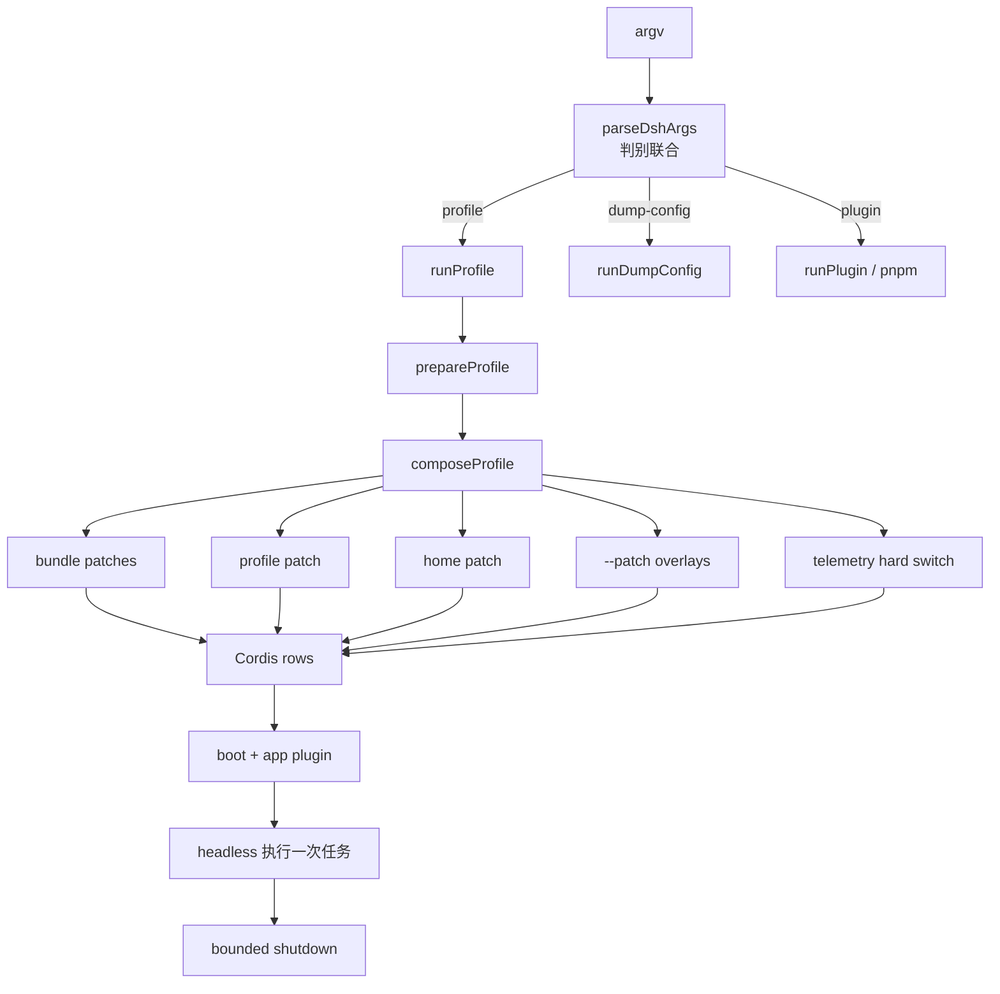

# 10. CLI、Profile 与无头运行

> 证据基线：固定提交 `47f943859bef60e4160492346772ded9b24f765a`。
> 本章用同一个场景贯穿：在 CI 中运行一次 headless 代码审查，并用临时 Overlay 替换一行配置。

## 0. 本章学习目标

学完后，你应该能够：

1. 从 `dsh --profile headless --patch ./ci.yml "审查改动"` 追到 `runProfile()`。
2. 解释 launcher 参数与 app 参数为什么在第一个未知 token 处分界。
3. 按正确顺序写出 Bundle、profile patch、home patch、CLI overlay 与遥测开关。
4. 说明 Patch 修改的是带 id 的配置行，不是任意深层对象 merge。
5. 使用 `--dump-config` 在不启动 Agent 的前提下审计最终组合。
6. 说清 boot 失败、Profile 不存在、退出超时等停止边界。

## 1. 一句话讲明白

**CLI 只负责选择和组合 Profile；真正的 Agent 能力由有序 Bundle 与 Patch 生成的 Cordis 插件树决定。**

上一章留下的黑盒是：“Skill、Subagent、jobs、persistence 到底是谁装进去的？”

本章中央问题是：

> 一条看似简单的 `dsh` 命令，怎样可审计地决定这次运行有什么插件、用什么配置、以什么界面执行，并在结束时可靠退出？

## 2. 贯穿场景：CI 中的一次无头审查

设想流水线执行：

```bash
dsh --profile headless --patch ./ci-model.patch.yml "审查本次提交，只输出风险清单"
```

期望有四点：

- 复用正式产品的模型、工具、Session 与权限基础设施；
- 不启动 Web server，也不等待人机 UI；
- 只在这一次运行里替换模型配置；
- 任务完成或失败后进程有边界地退出。

最直觉的实现是写一个新的 `main-ci.ts`，手工 new Agent、Tool、Provider。

为什么生产场景不够？

因为 Web、TUI、CI 会复制初始化顺序；新插件加到一个入口却漏掉另一个；测试也可能只验证手工拼出的假世界。

Harness 的答案是：**所有产品入口共享 Profile 组合机制，界面差异只是不同 Bundle。**

## 3. 先看地图：命令到插件树



读图结论：CLI 本身不逐个实例化能力，它把选择转换成配置层，再交给统一 boot。

## 4. 最小内核与产品叠加层

### 4.1 通用组合内核

下面是教学伪代码：

```ts
const invocation = parse(argv)
const profile = loadProfile(invocation.profile)

const patches = [
  ...profile.bundles,
  profile.userPatch,
  homePatch,
  ...invocation.overlays,
]

const rows = compose([], patches)
await boot(rows)
```

数据变化是：字符串 argv 先变为判别联合，再变为有序 Patch 列表，最后变为带 id 的 Cordis rows。

### 4.2 Harness 产品叠加层

通用内核之上，Harness 又加了：

- `web` 子命令作为 `--profile web` 别名；
- app 参数透传；
- profile/home 两级用户层；
- `DSH_TELEMETRY_DISABLED` 隐私硬开关；
- `--dump-config` 的 boot-free 审计；
- 进程信号与有界关闭。

不要把这些产品策略误认为 Cordis 本身必须如此。

## 5. 读源码前的三个必要概念

### 5.1 判别联合不是“字符串 mode”而已

`DshInvocation` 有三种形状：profile、dump-config、plugin。

每种形状只携带自己的字段。

**源码事实：** 三个接口和联合定义在 [`apps/cli/src/args.ts:20-48`](https://github.com/deepseek-ai/deepseek-harness/blob/47f943859bef60e4160492346772ded9b24f765a/apps/cli/src/args.ts#L20-L48)。

这让 `bin.ts` 的 switch 能用 `never` 检查遗漏分支。

### 5.2 Profile 与 Bundle 不同

Profile 是用户选择的命名组合，保存 Bundle 列表与用户 patch。

Bundle 是可分发的 Cordis 配置行集合。

**源码事实：** 二者定义及 `dsh.profile` / `dsh.bundle` manifest 约定在 [`docs/architecture.md:15-27`](https://github.com/deepseek-ai/deepseek-harness/blob/47f943859bef60e4160492346772ded9b24f765a/docs/architecture.md#L15-L27)。

### 5.3 Patch 的对象是 row

每行有稳定 id。

上层 patch 可以替换该行完整 config 或插入新行。

它不是把任意 YAML 深层属性做神秘 merge。

这使 `dump-config` 能给出确定结果。

## 6. 真实源码旅程：一次 headless 命令怎样启动

### 第 1 步：launcher 只解析自己拥有的参数

我们的 argv 是：

```text
--profile headless --patch ./ci-model.patch.yml "审查本次提交，只输出风险清单"
```

前两个 flag 属于 launcher。

最后的自然语言任务属于注入的 headless app。

`args.ts` 明确规定：第一个 launcher 不认识的 token 开始，余下参数原样交给 app。

**源码事实：** 文件头注释与示例在 [`apps/cli/src/args.ts:1-15`](https://github.com/deepseek-ai/deepseek-harness/blob/47f943859bef60e4160492346772ded9b24f765a/apps/cli/src/args.ts#L1-L15)。

**容易误读的细节：** 不要因为 Commander 配了 `allowUnknownOption()` 就认为未知参数被“忽略”。

实际条件是 `passThroughOptions()` 加位置参数，把未知 token 及之后内容保存到 `args`，交给 app 自己解析，见 [`apps/cli/src/args.ts:123-145`](https://github.com/deepseek-ai/deepseek-harness/blob/47f943859bef60e4160492346772ded9b24f765a/apps/cli/src/args.ts#L123-L145)。

### 第 2 步：`resolveBoot()` 生成 typed invocation

普通启动返回：

```ts
{
  mode: 'profile',
  profile: 'headless',
  patches: ['./ci-model.patch.yml'],
  args: ['审查本次提交，只输出风险清单']
}
```

如果同时传 `--dump-config` 和 `--dump-default-config`，解析阶段直接报互斥错误。

config dump 也拒绝 app args，因为它根本不启动 app，无法诚实说明 app flags 的效果。

**源码事实：** 这些检查在 [`apps/cli/src/args.ts:83-103`](https://github.com/deepseek-ai/deepseek-harness/blob/47f943859bef60e4160492346772ded9b24f765a/apps/cli/src/args.ts#L83-L103)。

数据到这里已从松散字符串变成编译器可穷尽的形状。

### 第 3 步：`bin.ts` 动态加载对应路径

`bin.ts` 对 `invocation.mode` 做 switch。

profile 才动态 import `profile-boot.ts`；plugin 和 dump 走各自模块。

**源码事实：** 分发路径在 [`apps/cli/src/bin.ts:27-52`](https://github.com/deepseek-ai/deepseek-harness/blob/47f943859bef60e4160492346772ded9b24f765a/apps/cli/src/bin.ts#L27-L52)。

为什么不是文件顶部全量 import？

帮助、版本和配置 dump 不需要加载完整运行时。

动态 import 让非启动路径保持薄，也减少无关模块初始化副作用。

### 第 4 步：`prepareProfile()` 建立空根

Profile 的根配置被写为 `[]`。

所有实际内容都通过 patch 层叠加。

**源码事实：** 空根文本与文件名在 [`apps/cli/src/profile-boot.ts:59-67`](https://github.com/deepseek-ai/deepseek-harness/blob/47f943859bef60e4160492346772ded9b24f765a/apps/cli/src/profile-boot.ts#L59-L67)。

更反直觉的是：根文件每次都会重写。

原因不是清空用户配置，而是防止 Loader 的 tree write-back 把已组合 rows 固化进根文件，导致下次重复插入 Bundle。

**源码事实：** 这一约束和 `prepareProfile()` 在 [`apps/cli/src/profile-boot.ts:85-103`](https://github.com/deepseek-ai/deepseek-harness/blob/47f943859bef60e4160492346772ded9b24f765a/apps/cli/src/profile-boot.ts#L85-L103)。

### 第 5 步：形成精确层叠顺序

组合结果不是四层，而是源码当前的五个来源：

```text
1. profile manifest 中 bundles，按声明顺序
2. profile/cordis.patch.yml
3. $DSH_HOME/cordis.patch.yml
4. --patch overlays，按 argv 顺序
5. telemetry hard-disable patch（若需要）
```

**源码事实：** `ComposedProfile` 分组和 `allPatches()` 顺序在 [`apps/cli/src/profile-boot.ts:105-129`](https://github.com/deepseek-ai/deepseek-harness/blob/47f943859bef60e4160492346772ded9b24f765a/apps/cli/src/profile-boot.ts#L105-L129)。

读表结论：越靠后的层优先级越高，CI overlay 可以覆盖用户层，但遥测硬关闭仍可最后生效。

### 第 6 步：为什么还有 home patch

profile patch 表达“这个 profile 的偏好”。

home patch 表达“这台机器所有 profile 的偏好”。

例如统一关闭某种本地能力，或统一指向某个凭据引用。

**源码事实：** home patch 的路径和定位在 [`apps/cli/src/profile-boot.ts:43-51`](https://github.com/deepseek-ai/deepseek-harness/blob/47f943859bef60e4160492346772ded9b24f765a/apps/cli/src/profile-boot.ts#L43-L51)。

### 第 7 步：Overlay 只影响本次 invocation

`./ci-model.patch.yml` 位于用户层之上。

它适合流水线、一次实验和故障隔离。

它不需要改 shipped Bundle，也不要求创建一份几乎相同的新 Profile。

**设计解读：** 这符合“默认组合稳定、临时差异显式”的原则。

### 第 8 步：命令参数进入插件树

launcher 不理解“审查本次提交”是什么意思。

`runProfile()` 通过 `ctx.cmdlineArgs` 提供不可变快照，由被注入的 app plugin 解析。

**源码事实：** 职责边界写在 [`apps/cli/src/profile-boot.ts:1-10`](https://github.com/deepseek-ai/deepseek-harness/blob/47f943859bef60e4160492346772ded9b24f765a/apps/cli/src/profile-boot.ts#L1-L10)。

这意味着增加 app flag 通常不必修改顶层 launcher。

### 第 9 步：headless Bundle 决定产品表面

`dsh-base` 提供模型、工具、持久化、sandbox、审批、设置与凭据等公共能力。

`dsh-headless` 增加一次性 runner，不启动 server。

`dsh-web-app` 则增加浏览器应用。

**源码事实：** Bundle 分工在 [`docs/architecture.md:23-25`](https://github.com/deepseek-ai/deepseek-harness/blob/47f943859bef60e4160492346772ded9b24f765a/docs/architecture.md#L23-L25)。

所以 Headless 不是“阉割版核心”，而是相同基础能力加不同 Surface。

### 第 10 步：任务结束进入 bounded shutdown

长期运行插件可能尚有 disposer、子进程或持久化刷新。

直接 `process.exit(0)` 会跳过清理；无限等待又会挂住 CI。

因此 profile boot 连接进程信号与有界关闭机制。

**源码事实：** `profile-boot.ts` 显式引入 `createProcessShutdown`，见 [`apps/cli/src/profile-boot.ts:37-40`](https://github.com/deepseek-ai/deepseek-harness/blob/47f943859bef60e4160492346772ded9b24f765a/apps/cli/src/profile-boot.ts#L37-L40)。

真正的停止状态不藏在 boot 函数里，而由独立 `ProcessShutdown` 控制器拥有：

```text
没有 pending
  ├─ shutdown(code)  → 启动 dispose，成功后只设置自然退出码
  └─ interrupt(code) → 启动 dispose，完成后主动退出

已有 pending
  └─ 再次 interrupt → 不再等待，立即 forceExit

任一路径超过 5000ms → forceExit
dispose reject       → forceExit
```

读图结论：第一次停止请求给插件树一次协作式收敛机会，重复信号、清理异常和五秒超时则明确升级为强制退出，因此 CI 不会无限悬挂。

**源码事实：** 默认宽限预算是 `5_000ms`，公开控制面只有 `shutdown()` 与 `interrupt()`，见 [`apps/cli/src/process-shutdown.ts:1-12`](https://github.com/deepseek-ai/deepseek-harness/blob/47f943859bef60e4160492346772ded9b24f765a/apps/cli/src/process-shutdown.ts#L1-L12)。第一次调用会复用同一个 `pending`，设置超时并等待整个应用 disposer；dispose 成功、失败与超时走不同结束分支，见 [`apps/cli/src/process-shutdown.ts:52-76`](https://github.com/deepseek-ai/deepseek-harness/blob/47f943859bef60e4160492346772ded9b24f765a/apps/cli/src/process-shutdown.ts#L52-L76)。

**设计解读：** 把 shutdown controller 从 Profile 组合中拆开，使相同的进程停止策略可以独立单测；它只依赖“整个应用如何 dispose”，并不知道 Headless、Web 或具体插件。

## 7. `--dump-config`：启动前先看真实世界

现在把命令改成：

```bash
dsh --profile headless --patch ./ci-model.patch.yml --dump-config
```

它会组合相同配置层，但不启动 app。

你应检查：

- 目标 row id 是否存在；
- Overlay 是否覆盖了正确行；
- tool、Provider、persistence 是否仍在树中；
- 是否意外插入重复 row；
- 输出里是否只有 CredentialRef，而没有密钥值。

`--dump-default-config` 则跳过用户层，也禁止 `--patch`。

它适合比较 shipped 默认值与本机最终值。

### 一个诊断顺序

```text
命令行为异常
  → dump-default-config：发行默认是否正确？
  → dump-config：profile/home 是否改坏？
  → dump-config + overlay：临时层是否生效？
  → 最后才真正 boot
```

读图结论：先比较配置产物，再观察运行时，能把“组合错误”与“插件执行错误”分开。

## 8. Web、Headless、Plugin 三条路径的真实差异

| 路径 | 是否 boot Cordis 树 | 是否解析 app args | 主要输出 |
| --- | --- | --- | --- |
| profile / web | 是 | 是，交给 app plugin | 产品运行结果 |
| dump-config | 否 | 否，明确拒绝 | 组合后的 rows |
| plugin | 否 | pnpm args 原样转发 | 依赖管理结果 |

读表结论：三者共享 launcher 语法入口，但只有 profile 路径创建 Agent 运行世界。

`web` 不是第四种 invocation mode。

它只是固定选择 `profile: 'web'` 的别名。

**源码事实：** web action 最终仍调用 `resolveBoot(..., 'web', ...)`，见 [`apps/cli/src/args.ts:156-169`](https://github.com/deepseek-ai/deepseek-harness/blob/47f943859bef60e4160492346772ded9b24f765a/apps/cli/src/args.ts#L156-L169)。

## 9. 失败与停止边界

### 9.1 缺少 Profile 名称

裸 `dsh` 不猜默认 Profile。

若没有 `--profile`，除纯 help 外直接报错。

这是避免“在错误产品面启动”的 fail-loud 边界。

### 9.2 dump 不能混入 app args

`--dump-config --resume abc` 会被拒绝。

因为 dump 没运行处理 `--resume` 的 app plugin，若接受会产生误导性配置报告。

### 9.3 `--patch` 是单值可重复，不是 variadic

若做成 variadic，它可能吞掉后面的 app prompt。

**源码事实：** collector 设计说明在 [`apps/cli/src/args.ts:57-61`](https://github.com/deepseek-ai/deepseek-harness/blob/47f943859bef60e4160492346772ded9b24f765a/apps/cli/src/args.ts#L57-L61)。

### 9.4 遥测开关采用隐私优先语义

`DSH_TELEMETRY_DISABLED` 任何非空值，包括字符串 `"0"` 或 `"false"`，都表示关闭。

**源码事实：** 语义和 patch 生成在 [`apps/cli/src/profile-boot.ts:69-83`](https://github.com/deepseek-ai/deepseek-harness/blob/47f943859bef60e4160492346772ded9b24f765a/apps/cli/src/profile-boot.ts#L69-L83)。

**容易误读的细节：** 这里不是常见布尔字符串解析；字段名叫 DISABLED，源码选择“非空即关闭”，不要凭值 `false` 推断为启用。

### 9.5 启动失败不能留下半棵可用 UI

组合或插件装载失败应通过 fail-loud 报告，而不是继续提供部分能力。

部分启动会让安全工具、审批或持久化缺失时仍接受用户任务。

### 9.6 关闭既不能粗暴，也不能无限

第一次信号应触发协作式 dispose。

超出预算或重复信号必须有明确终止策略。

这对 CI 尤其重要：成功退出证明资源已收敛，超时退出证明停止边界生效。

这里还有一个容易误读的条件：`interrupt()` 并非第一次信号就无条件 `process.exit()`；只有已经存在 `pending` 的重复中断才立即强制退出。第一次中断仍先走 `start(code, true)`，等待 disposer 或超时，见 [`apps/cli/src/process-shutdown.ts:65-75`](https://github.com/deepseek-ai/deepseek-harness/blob/47f943859bef60e4160492346772ded9b24f765a/apps/cli/src/process-shutdown.ts#L65-L75)。

## 10. DeepSeek Harness 的选择与取舍

### 10.1 一个 launcher，多种 app 自治参数

优点：新增 Surface 参数不膨胀顶层 CLI。

代价：参数顺序有约束，launcher flag 必须放在 app args 之前。

### 10.2 空根 + 全 Patch 组合

优点：每一行来源可追踪，上层可覆盖。

代价：需要稳定 row id，错误 id 可能插入意外新行。

### 10.3 Profile 与 Bundle 分离

优点：发行方复用 Bundle，用户持有 Profile 差异。

代价：排查时必须同时理解 manifest 层和 patch 层。

### 10.4 dump 与 boot 共用组合逻辑

优点：诊断的是实际将启动的树。

代价：dump 无法展示 app 运行时根据参数做出的决定，所以明确拒绝 app args。

## 11. Java 类比，以及边界

### 11.1 Profile 像 Spring Profile 吗

相似处：都能选择一组部署配置。

失效处：Harness Profile 是有序 Bundle + Patch 生成插件树，不只是 property source 或条件 Bean 集合。

### 11.2 Bundle 像 Spring Boot Starter 吗

相似处：把一组常用能力打包复用。

失效处：Bundle 主要分发 Cordis rows，而且上层 patch 可以按 id 替换每行完整 config。

### 11.3 `DshInvocation` 像 sealed interface 吗

这最接近 Java 17 的 sealed hierarchy。

TypeScript 的 `mode` discriminant 让 switch 穷尽；但运行时仍需 Commander 做输入校验，类型不会自动验证 argv。

## 12. 可以带走的方法

### 方法一：把产品差异放在组合层

不要为 Web 与 CI 复制核心初始化。

验证问题：移除 Surface 后，模型、工具和 Session 基础能力是否仍来自同一 Bundle？

### 方法二：提供可审计的最终配置

任何多层配置系统都应能输出 effective config。

验证问题：报告是否与真正 boot 使用同一组合函数和 base URL？

### 方法三：参数所有权清晰分层

launcher 只拿自己拥有的 flag，其余原样交给内部 app。

验证问题：新增 app flag 是否需要修改 launcher？如果需要，边界可能泄漏。

## 13. 费曼复述与自测

1. 为什么 `web` 不是独立的第四种 `DshInvocation`？
2. 为什么根 `cordis.yml` 每次都重写为空列表？
3. 写出五个配置来源的精确应用顺序。
4. 为什么 `--dump-config` 拒绝 app args，而不是简单忽略？
5. `DSH_TELEMETRY_DISABLED=false` 在当前源码中会启用还是关闭遥测，为什么？

合格复述：

> CLI 先把 argv 解析成 profile、dump 或 plugin 判别联合。profile 路径加载命名 Profile，以空根为起点，按 Bundle、profile、home、CLI overlay 和遥测硬开关组合 rows；随后统一 boot，再把剩余参数交给 app plugin。Headless 与 Web 的差异来自 Bundle，不来自复制 Agent 核心。

## 14. 三级练习

### Level 1：只读诊断

运行两个 dump 并做 diff：

```bash
dsh --profile headless --dump-default-config
dsh --profile headless --dump-config
```

标出哪些 row 来自用户层。

### Level 2：设计 Overlay

设计 `ci-model.patch.yml`：

- 只替换模型 Provider 相关 row；
- 不改变工具、sandbox、审批与持久化；
- 用 dump 证明目标 row 被覆盖且没有新增拼错 id 的行。

### Level 3：增加一个 Profile

组合已有 `dsh-base` 与 headless runner，创建“只读审查” Profile：

- 通过 Patch 限制写工具；
- 保留 Session persistence；
- 写 built-bin smoke，从发布 `lib/bin.js` 启动；
- 断言任务结束后进程退出，不只断言 stdout 有关键词。

## 15. 常见误区与第一遍可忽略内容

- 不要把 Profile 当环境变量集合，它是插件树组合。
- 不要把 `allowUnknownOption` 读成丢弃未知参数，实际是透传边界的一部分。
- 不要假设 Patch 深层 merge；先看 row id 与完整 config。
- 第一遍可忽略 profile module fallback 的平台细节，但不能忽略 source/built 使用同一安装锚点。
- 第一遍可不展开每个 Bundle 的全部行，但必须能说明 base 与 Surface Bundle 的依赖方向。

## 16. 小结与下一章钩子

我们终于打开上一章的装配黑盒：

- CLI 把输入变成 typed invocation；
- Profile 把发行 Bundle 与用户差异组织起来；
- Patch 顺序给每项能力明确来源与覆盖关系；
- Headless 与 Web 共享核心，只替换产品 Surface；
- dump、fail-loud 和 bounded shutdown 让启动与停止可审计。

但 `web` Profile 启动以后，还有一个新黑盒：

> durable Session Event 怎样变成浏览器里一行消息、一棵 Tool Call Tree 和一个可点击卡片，而 UI 又不复制 Agent 状态机？

下一章沿一次真实工具调用进入 Web / TUI 产品界面。
