# 11. Web / TUI 产品界面

> 证据基线：固定提交 `47f943859bef60e4160492346772ded9b24f765a`。
> 贯穿场景：用户在 Web 中说“运行测试”，模型调用 Bash，界面先显示运行中卡片，随后显示完成结果。

## 0. 本章学习目标

学完后，你应该能够：

1. 区分 Host、Browser Client runtime、Conversation projection 与 UI plugin。
2. 解释 `apps/web/src/main.ts` 为什么只有十行，而不是“Web 功能很少”。
3. 沿 `tool/call` / `tool/result` 追到 Conversation Context、Chat Node 和 `ToolCallTree`。
4. 说清 `ConversationNodeDefinition` 与 keyed renderer 为什么必须使用相同 kind。
5. 区分 durable event、projection state、renderer props 与本地交互状态。
6. 说明缺 renderer、未知 Tool、插件卸载、长 Session 等边界。

## 1. 一句话讲明白

**产品界面不运行另一套 Agent：它把同一份 Session 事实增量投影成具名 Conversation Node，再由 keyed Slot 选择 Web 或 TUI 的呈现方式。**

上一章打开了 Profile 组合，却把 `dsh-web-app` 当成一个黑盒。

本章中央问题是：

> Agent 只写 durable events，浏览器怎样把这些事实变成可交互界面，同时允许插件增加新业务行而不修改中央 switch？

## 2. 贯穿场景：一条 Bash 调用怎样出现在聊天里

用户输入：

```text
运行测试，并告诉我失败原因。
```

模型随后发出 `bash` Tool Call。

界面必须经历这些可见状态：

1. 用户消息出现；
2. assistant streaming 或 reasoning 出现；
3. Bash 卡片显示 `running`；
4. 子调用如果存在，按树形嵌套；
5. `tool/result` 到达后，卡片变为 `ok`、`error` 或 `stopped`；
6. 刷新页面后，从 Session Log 重放出同样结果。

最直觉的方案是让 React 直接订阅 Agent 对象，并在组件里处理每种 event。

生产场景为什么不够？

- React 组件会复制 Agent 状态机；
- 历史重放与实时 tail 走两套逻辑；
- 新业务 event 要修改中央 `switch(event.type)`；
- Web 组件无法直接复用于 TUI；
- live Agent 销毁后，历史页面失去数据来源。

Harness 的解决方案是四层分工：**事实、投影、业务节点、呈现适配。**

## 3. 先画地图：从 Host 到一张卡片

```mermaid
flowchart LR
  A["Agent / Tool Runtime"] --> B["Session Event Log\ntool/call, tool/result"]
  B --> C["Host transport / object service"]
  C --> D["Browser Session store"]
  D --> E["ConversationNodeAssembler"]
  E --> F["Conversation Context"]
  F --> G["Chat View Node\nkind=tool-call"]
  G --> H["conversation.chat.node slot"]
  H --> I["ToolCallTree"]
  I --> J["tool.call.toolview\nentryKey=bash"]
  J --> K["Bash / terminal card"]
```



读图结论：UI 从 durable event 的投影读取，不跨边界抓取活 Tool 或 Agent 对象。

## 4. 最小内核与 Harness 产品层

### 4.1 通用 Agent UI 内核

```ts
for (const event of sessionEvents) {
  projection = reduce(projection, event)
}

for (const node of projection.visibleNodes) {
  renderByKind(node.kind, node.data)
}
```

这只是最小真相：event 进入 reducer，状态变为可渲染 node。

### 4.2 Harness 的产品叠加层

Harness 没有一个巨型 reducer，而是增加：

- Definition Registry：插件贡献“哪些事件组成一种业务 Context”；
- incremental Assembler：只处理新 tail，保留稳定 Context identity；
- View Builder：把 Context 转成特定 target 的 Node；
- Slot Registry：按 kind / tool name 路由 renderer；
- Session-aware props：文件打开、详情、选择等能力由宿主注入；
- fallback：未知 node 或 Tool 仍能显示原始信息。

这些层解决可扩展性、重放一致性和性能，但没有改变 Session Event 是事实源。

## 5. 四类数据必须分开

| 数据 | 示例 | 所有者 | 是否持久 |
| --- | --- | --- | --- |
| Session Event | `tool/call`、`tool/result` | Host Session | 是 |
| Conversation State | call/result 配对、Context matches | Client runtime | 可重建 |
| Chat Node Data | `kind: tool-call`、root block | View builder | 可重建 |
| View Local State | 展开、选中、滚动位置 | Web/TUI renderer | 通常否 |

读表结论：持久化事实必须足以重建前三层，但无需把每次 UI 展开动作写进 Session。

### 一个重要边界

Tool 的 model-facing content 与 UI presentation 不是同一份字符串。

模型需要读执行结果；UI 需要结构化卡片意图。

如果 UI 通过解析 prose 猜“这是一段 diff”，重放和多语言都会脆弱。

## 6. 真实源码旅程：从 Web 入口到 Bash 卡片

### 第 1 步：入口只寻找 mount point

`apps/web/src/main.ts` 获取 `#root`，不存在就立即抛错，然后创建 `AppWebEntry`。

**源码事实：** 全文件路径在 [`apps/web/src/main.ts:1-10`](https://github.com/deepseek-ai/deepseek-harness/blob/47f943859bef60e4160492346772ded9b24f765a/apps/web/src/main.ts#L1-L10)。

**容易误读的细节：** “入口只有十行”不等于“Web 是硬编码单体或没有装配”。

实际条件是 loader holding、module table、AppRoot gate 和 plugin assembly 被移入 `@deepseek-ai/dsh-client-web`，入口注释已明确说明。

### 第 2 步：`AppRoot` 先守住 boot gate

插件尚未全部 active 时，界面只显示 kernel 自给的加载页。

若任何 entry 失败，继续留在失败页，而不是渲染半套真实 UI。

**源码事实：** `settled`、status、error 三个 signal 以及 fail-loud 分支在 [`packages/client/web/src/AppRoot.tsx:16-59`](https://github.com/deepseek-ai/deepseek-harness/blob/47f943859bef60e4160492346772ded9b24f765a/packages/client/web/src/AppRoot.tsx#L16-L59)。

为什么这样设计？

因为真实 UI 本身依赖插件；若失败页也依赖那些插件，最需要报错时反而可能白屏。

### 第 3 步：真实 UI 从唯一 root slot 长出来

boot settled 后，`buildRenderApp()` 读取 sessions service，绑定标题，并调用：

```ts
ctx.slots.renderSlot('root', {})
```

**源码事实：** 真实装配闭包在 [`packages/client/web/src/app.tsx:21-43`](https://github.com/deepseek-ai/deepseek-harness/blob/47f943859bef60e4160492346772ded9b24f765a/packages/client/web/src/app.tsx#L21-L43)。

数据到此还不是聊天列表。

root slot 只是“哪一个布局插件占据应用根”的组合点，具体 Conversation 区域由下层 slot 继续声明。

### 第 4 步：Session Event 进入增量 Assembler

Browser session store 提供连续事件窗口。

首次打开或 gap 修复调用 `replaceWindow()`：清空旧索引，按 seq 排序，重建 location，再匹配所有输入。

实时新事件调用 `append()`：若 seq 已存在直接忽略；否则只追加新 input，更新位置边界并匹配当前 event。

**源码事实：** 两条路径在 [`packages/client/runtime/src/client/sessions/conversation-assembler.ts:162-215`](https://github.com/deepseek-ai/deepseek-harness/blob/47f943859bef60e4160492346772ded9b24f765a/packages/client/runtime/src/client/sessions/conversation-assembler.ts#L162-L215)。

数据变化：

```text
wire event { seq, type, payload }
  → ConversationEventInput
  → Definition match
  → InternalContext { key, kind, id, matches, state, current }
```

`InternalContext` 的真实字段见 [`packages/client/runtime/src/client/sessions/conversation-assembler.ts:20-33`](https://github.com/deepseek-ai/deepseek-harness/blob/47f943859bef60e4160492346772ded9b24f765a/packages/client/runtime/src/client/sessions/conversation-assembler.ts#L20-L33)。

### 第 5 步：Definition 决定哪些事件属于同一 Context

对于 Bash 调用，`tool/call` 与后续同 callId 的 `tool/result` 要组成同一个业务 Context。

Definition 负责匹配、归并状态和构造 view node，而不是 React 组件去扫描日志找另一半。

Registry 要求 key 唯一，重复注册直接抛错；注册随 Cordis effect 生命周期撤销。

**源码事实：** `registerDefinition()` 的唯一性和 disposer 在 [`packages/client/runtime/src/client/conversation/definition-registry.ts:27-53`](https://github.com/deepseek-ai/deepseek-harness/blob/47f943859bef60e4160492346772ded9b24f765a/packages/client/runtime/src/client/conversation/definition-registry.ts#L27-L53)。

为什么用 Context，而不是“一 event 一 node”？

因为一个 UI 业务对象通常跨多个 event 生长：call 先出现，result 后到达，期间还可能有子调用和 streaming 更新。

### 第 6 步：Context identity 必须稳定

Assembler 用 `kind + id` 生成 Context key。

**源码事实：** key 编码函数在 [`packages/client/runtime/src/client/contract/conversation.ts:271-274`](https://github.com/deepseek-ai/deepseek-harness/blob/47f943859bef60e4160492346772ded9b24f765a/packages/client/runtime/src/client/contract/conversation.ts#L271-L274)。

它不是简单 `${kind}:${id}`，而是包含 kind 长度，避免歧义拼接。

稳定 key 让 React 只更新目标 Node，也让 selection 和滚动锚点在增量更新中存活。

### 第 7 步：注册表把多种业务节点组合起来

`ui-conversation` 依次注册 inbox、message、assistant、tool、command、compaction、retry、turn error、turn tail 和 fallback。

**源码事实：** 汇总注册表在 [`packages/client/ui-conversation/src/client/conversation-nodes/register.ts:1-32`](https://github.com/deepseek-ai/deepseek-harness/blob/47f943859bef60e4160492346772ded9b24f765a/packages/client/ui-conversation/src/client/conversation-nodes/register.ts#L1-L32)。

这里仍然不是中央 event switch。

它只是默认产品装配了哪些独立 Definition；其他插件可以贡献自己的 Definition 和 renderer。

### 第 8 步：Chat Node 通过 kind 进入 keyed slot

`ChatNodeSeat` 只订阅自己的 `nodeKey`，不观察兄弟 Node。

取得 node 后，它把 `routedNode.kind` 作为 `entryKey` 调用 `conversation.chat.node`。

**源码事实：** 订阅、路由和 fallback 在 [`packages/client/ui-conversation/src/client/chat/ChatNodeSeat.tsx:18-60`](https://github.com/deepseek-ai/deepseek-harness/blob/47f943859bef60e4160492346772ded9b24f765a/packages/client/ui-conversation/src/client/chat/ChatNodeSeat.tsx#L18-L60)。

如果没有对应 renderer，会显示 `JsonBlock`，而不是白屏或丢失事实。

**容易误读的细节：** “未注册 renderer”并不等于 Session Log 缺失或 Agent 能力没执行。

它只表示当前 Surface 不认识这种呈现；raw node data 仍可回退展示。

### 第 9 步：Tool Node 再进行第二次 keyed dispatch

Chat 层识别这是一个 `tool-call` Node，于是进入 `ToolCallTree`。

树中每个原子调用都按真实 tool name 路由 `tool.call.toolview`。

我们的 `bash` 因此可以命中终端专用 renderer；未知工具走 `GenericToolCard`。

**源码事实：** 原子 dispatch 在 [`packages/client/ui-tool/src/client/tool/ToolCallTree.tsx:13-45`](https://github.com/deepseek-ai/deepseek-harness/blob/47f943859bef60e4160492346772ded9b24f765a/packages/client/ui-tool/src/client/tool/ToolCallTree.tsx#L13-L45)。

### 第 10 步：子调用递归使用同一路径

`ToolCallBranch` 读取 `block.subCalls`，对子项递归调用自身。

根调用和任意深度子调用都使用相同 atomic dispatch。

**源码事实：** 递归在 [`packages/client/ui-tool/src/client/tool/ToolCallTree.tsx:47-82`](https://github.com/deepseek-ai/deepseek-harness/blob/47f943859bef60e4160492346772ded9b24f765a/packages/client/ui-tool/src/client/tool/ToolCallTree.tsx#L47-L82)。

读代码结论：调用树拓扑属于 Runtime 投影，renderer 不维护另一份 parent-child map。

### 第 11 步：结果状态由结构化 block 推导

工具结果到达后，纯函数 `toolRowModel()` 计算状态：

```text
未完成                         → running
error.code === interrupted     → stopped
isError                        → error
否则                           → ok
```

**源码事实：** 状态分支在 [`packages/client/ui-tool/src/client/tool/models/tool-call-model.ts:204-239`](https://github.com/deepseek-ai/deepseek-harness/blob/47f943859bef60e4160492346772ded9b24f765a/packages/client/ui-tool/src/client/tool/models/tool-call-model.ts#L204-L239)。

这不是从输出文本里搜索“success”或“error”。

数据从 running call block 变为 settled result block，卡片模型只做纯推导，因此历史 replay 与 live rendering 一致。

## 7. 为什么需要两级路由

第一级：`conversation.chat.node` 按业务 Node kind 路由。

例如 message、assistant、tool-call、command。

第二级：`tool.call.toolview` 按 Tool wire name 路由。

例如 bash、read、grep、自定义工具。

| 只用一级路由会怎样 | 两级路由的结果 |
| --- | --- |
| 每个 Tool 都要成为 Chat Node kind | Tool 共享 call/result 生命周期 |
| Chat 层知道所有 Tool 名 | Tool 插件自己贡献专用卡片 |
| 未知 Tool 难回退 | generic card 天然兜底 |

读表结论：Chat 层拥有时间线位置，Tool 层拥有领域呈现，职责不会互相吞并。

## 8. Web 与 TUI 真正共享什么

它们应共享：

- Session Event 语义；
- call/result 配对；
- Conversation Context 与 Node 数据；
- Tool presentation intent；
- stable key、状态与失败语义。

它们不必共享：

- React 组件；
- 终端字符宽度计算；
- 浏览器拖放和 lightbox；
- 键盘焦点策略；
- CSS 动画与响应式布局。

**设计解读：** 复用领域投影，而不是强迫不同渲染环境共享视图组件，才能避免“最低公分母 UI”。

## 9. 失败、停止与性能边界

### 9.1 缺少 `#root`

入口立即抛错。

这把错误定位为 HTML mount contract 破坏，而不是等待一个永远不会出现的空白页。

### 9.2 boot 未完全 settled

`AppRoot` 不渲染真实 UI。

缺一部分插件时显示半成品界面可能绕过权限、设置或 renderer 依赖。

### 9.3 重复 Definition key

Registry 立即报错，不采用 last-wins。

否则两个插件对同一种业务 Context 的解释会取决于装载顺序。

### 9.4 未知 Chat Node

使用 JSON fallback，事实仍可见。

这是显示降级，不是领域数据降级。

### 9.5 未知 Tool 或旧 presentation meta

走 Generic Tool Card 或扁平结果文本。

显示路径应 soft-fail，历史 replay 不应被旧数据炸毁。

### 9.6 duplicate seq

`append()` 遇到已存在 seq 返回 `none`。

避免 transport 重复投递造成双节点。

### 9.7 Context 收到重复 Match

merge 时同 seq 重复会抛错。

**源码事实：** duplicate Match 检查在 [`packages/client/runtime/src/client/sessions/conversation-assembler.ts:94-117`](https://github.com/deepseek-ai/deepseek-harness/blob/47f943859bef60e4160492346772ded9b24f765a/packages/client/runtime/src/client/sessions/conversation-assembler.ts#L94-L117)。

### 9.8 长 Session 不应每次全量扫描

首次 replace 可以全量重建；live tail append 只匹配新 event。

每个 `ChatNodeSeat` 只订阅自己的 key。

这两个边界共同避免“一条 token 更新整页消息”。

### 9.9 插件卸载必须撤销 UI 贡献

Definition 与 Slot registration 都是 effect。

HMR 后 disposer 移除旧贡献，避免重复 renderer 和幽灵业务行。

## 10. DeepSeek Harness 的选择与取舍

### 10.1 Event Log 是事实源

优点：刷新、重放、TUI/Web 一致。

代价：model-visible 或 UI 必需事实要设计 durable event / meta，不能依赖 live object。

### 10.2 Definition + View 分离

优点：一个业务 Context 可输出不同 target projection。

代价：开发者要理解 match、state、view node 三层，而不是写一个 React reducer。

### 10.3 keyed Slot 代替中央 switch

优点：新插件独立扩展，卸载即消失。

代价：kind、entryKey 和 declaration merge 必须一致，否则只能走 fallback。

### 10.4 fallback 保留可观察性

优点：旧客户端面对新事件仍能显示 raw data。

代价：fallback 体验不如专用 renderer，但不会伪装成完整支持。

## 11. Java 类比，以及边界

### 11.1 Projection 像 CQRS Read Model

相似处：append-only 事实生成面向查询/显示的读模型。

失效处：这里的投影在浏览器内增量维护，还结合 Slot 插件生命周期，不是服务端数据库物化视图。

### 11.2 Definition Registry 像 Spring HandlerMapping

相似处：注册 handler，根据 key/match 分发。

失效处：Definition 不直接渲染响应，它累积跨 event Context，再由 View Builder 产出 Node。

### 11.3 Slot 像 Java SPI

相似处：插件按 key 贡献实现。

失效处：Slot 还携带 React owner props、子 slot 声明、优先级和 effect 撤销，不只是类路径发现。

## 12. 可以带走的方法

### 方法一：让 UI 读取投影，不读取活核心对象

验证问题：Agent 被销毁、页面刷新后，界面能否只凭 Session 事实重建？

### 方法二：用 stable key 保存增量身份

验证问题：一个 result 到来时，是更新旧 call Node，还是删除再创建一个无关 Node？

### 方法三：把时间线归属与领域卡片归属分开

验证问题：新增 Tool 专用卡片是否需要修改 Chat 时间线核心？正确答案应是否。

## 13. 费曼复述与自测

1. 为什么 Web 入口只有十行仍能承载复杂插件系统？
2. `replaceWindow()` 与 `append()` 分别何时使用，性能差异是什么？
3. 为什么 `tool/call` 和 `tool/result` 应组成一个 Context，而不是两个独立卡片？
4. Chat Node renderer 缺失时，Agent 工作是否丢失？界面实际怎样处理？
5. 为什么 Tool 专用卡片按 tool name 做第二级 dispatch？

合格复述：

> Host 记录 Session Event；Client Assembler 按 Definition 把相关 event 累积成稳定 Context，再由 View Builder 生成具名 Chat Node。Chat Node 先按 kind 进入会话 Slot，Tool Node 又按 wire tool name 进入卡片 Slot。Web/TUI 共享事实与投影，不共享全部视图组件；未知类型走 raw/generic fallback。

## 14. 三级练习

### Level 1：只读追踪

从 `apps/web/src/main.ts` 出发，列出直到 `ToolCallTree` 的路径。

每一步写明输入对象与输出对象，不只列文件名。

### Level 2：设计 `review/decision` Node

设计字段：

- durable `review/decision` event；
- Context kind 与 id；
- accumulated state；
- ChatNodeDataMap 数据；
- renderer props；
- renderer 缺失时 fallback 内容。

### Level 3：最小实现与测试

实现这个 Node：

- 注册 Definition 与同 kind renderer；
- 测试 append 与 replay 产生同一 Node；
- 测试 disposer 后贡献消失；
- 测试未知 renderer 仍显示 raw payload；
- 浏览器 e2e 断言用户实际看到 decision，而不是只断言 registry 有 key。

## 15. 常见误区与第一遍可忽略内容

- 不要让 React 扫描完整 Session Event window 配对 call/result。
- 不要把 UI card 数据塞进 model-facing prose 再解析。
- 不要认为 fallback 意味能力成功适配，它只是保留可观察性。
- 第一遍可以忽略 location dependency 的全部优化细节，但不能忽略 stable Context key。
- 第一遍可以不读所有 CSS，但必须分清领域状态与本地展开状态。

## 16. 小结与下一章钩子

本章打开了 `dsh-web-app`：

- 极薄入口把装配交给 client-web；
- AppRoot 在插件完全 active 前守住 fail-loud gate；
- Session Event 经 Definition 与 Assembler 长成稳定 Context；
- Chat 和 Tool 使用两级 keyed Slot 呈现；
- Web/TUI 共享事实与投影，而不是共享所有组件。

现在只剩最后一个工程问题：

> 如果要新增一个真正能力，怎样选择扩展点、拆分 Definition / Provider / Consumer，并用测试证明它从配置、执行到用户可见结果都工作？

下一章用 Web Search 这条真实能力链完成扩展与验证闭环。
