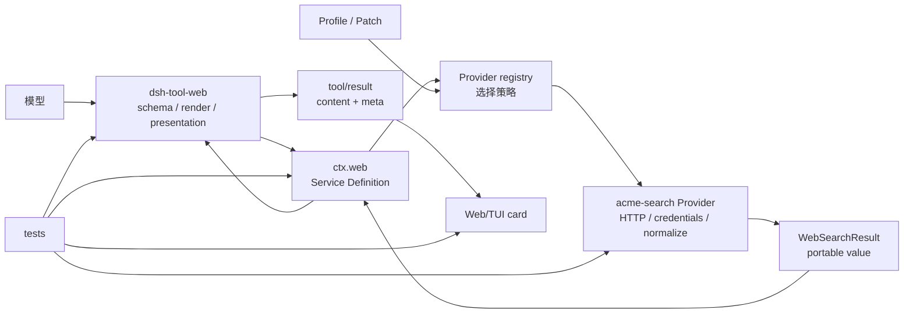
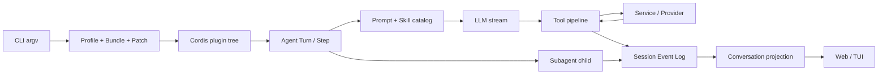

# 12. 扩展、测试与实战

> 证据基线：固定提交 `47f943859bef60e4160492346772ded9b24f765a`。
> 贯穿场景：为 Harness 增加一个新的搜索后端，并证明模型、Session 与 Web 用户真正能使用它。

## 0. 本章学习目标

学完后，你应该能够：

1. 为需求选择 Service、Provider、Tool、Event Hook 或 UI Node，而不是默认修改 Agent Loop。
2. 用 Web Search 解释 Service Definition、Service Provider、Consumer 三角色。
3. 沿一次 `web_search({ query })` 追过 Tool、`ctx.web`、Provider、结构化结果和 UI meta。
4. 设计 Provider 选择、取消、错误码、输出上限和 effect 卸载边界。
5. 建立 unit、assembled integration、keyless snapshot、with-key e2e 与 built-artifact smoke 的证据链。
6. 判断“绿色单测”是否真的证明产品可用。

## 1. 一句话讲明白

**合格扩展不是多写一个函数，而是把能力契约、可替换实现、真实消费方、配置接线、失败语义和产品入口测试闭合成一条链。**

上一章说明 UI 只是 Session 事实的投影。

本章中央问题是：

> 如果我们增加一个新的搜索后端，怎样让模型工具稳定可见、执行时选择正确 Provider、结果可重放呈现，并用测试证明发布后的真实产品没有断线？

## 2. 贯穿场景：新增 `acme-search` Provider

假设公司有内部搜索 API，要接入 Harness。

最直觉的方案是在 `web_search` 工具里直接写：

```ts
if (config.provider === 'acme') {
  return fetchAcme(args.query)
}
```

生产场景为什么不够？

- Tool 同时拥有模型 schema、Provider 选择、HTTP、凭据和结果标准化；
- 第二个搜索 Provider 会继续扩大 switch；
- Web 与未来其他 consumer 不能复用搜索能力；
- 单测只能 mock 自己，无法证明真实 Registry 与 Tool 接上；
- Provider 缺失时，工具 schema 可能随装载时序忽隐忽现。

Harness 已给出成熟形状：

```text
dsh-web                 Service Definition + registry + selection
dsh-web-search-*        Provider
dsh-tool-web            model-facing Consumer
Profile / Bundle        deployment wiring
tests                   contract → assembly → product
```

我们不虚构 `weather` 子系统，而是沿仓库真实 Web Search 能力学习扩展方法。

## 3. 先选扩展点，不要先建文件

| 需求 | 应选机制 | 不该先改哪里 |
| --- | --- | --- |
| 新搜索后端 | `ctx.web.registerSearchProvider()` | `agent-loop` |
| 新模型动作 | `ctx.tools.register()` | LLM adapter |
| 拦截工具权限 | `tools/pre-execute` / guard | 每个 Tool execute |
| 新 durable 事实 | `SessionEventMap` + projection | React local state |
| 新 Chat 行 | Conversation Definition + renderer | 中央 message switch |
| 新后台任务 | `ctx.jobs` / subagent / workflow | 裸全局 Promise |

读表结论：先找拥有该变化语义的 seam，只有没有既有扩展点时才考虑修改核心循环。

**源码事实：** 官方“新行为放哪里”矩阵在 [`docs/architecture.md:104-128`](https://github.com/deepseek-ai/deepseek-harness/blob/47f943859bef60e4160492346772ded9b24f765a/docs/architecture.md#L104-L128)。

## 4. 位置图：三角色怎样闭环



读图结论：Provider 不直接注册模型工具，Tool 也不直接理解每种后端；`WebSearchResult` 是双方之间的可移植值。

## 5. 最小机制：先写最短正确闭环

下面是教学伪代码：

```ts
interface SearchProvider {
  id: string
  available(): boolean
  search(request, signal): Promise<SearchResult>
}

// Provider plugin
ctx.web.registerSearchProvider(acmeProvider)

// Consumer tool
ctx.tools.register(defineTool({
  name: 'web_search',
  async execute(args, exec) {
    return ctx.web.search({ query: args.query, maxResults: 10 }, exec.signal)
  },
}))
```

数据变化：

```text
模型 JSON args
  → 通过 Tool schema 验证的 { query }
  → WebSearchRequest { query, maxResults }
  → Provider-specific HTTP request
  → Provider response
  → WebSearchResult { content?, sources[], truncated }
  → canonical Tool value + model content + presentation meta
```

最小版本先做：一个 Provider、一个请求、一个标准结果、明确取消和错误。

不要提前做多 Provider fallback、缓存、批量 query 和重试矩阵。

## 6. 读源码前的关键契约

### 6.1 `WebSearchRequest`

请求只有 query 和可选 `maxResults`。

Provider API 支持数量控制时可以把它下推以节约成本，但 seam 返回前仍会强制截断。

**源码事实：** 字段和双层约束在 [`packages/web/web/src/types.ts:10-25`](https://github.com/deepseek-ai/deepseek-harness/blob/47f943859bef60e4160492346772ded9b24f765a/packages/web/web/src/types.ts#L10-L25)。

### 6.2 `WebSearchResult`

portable result 包含：

- 可选 `content`；
- 必需 `sources[]`；
- 必需 `truncated`。

**源码事实：** 类型在 [`packages/web/web/src/types.ts:27-41`](https://github.com/deepseek-ai/deepseek-harness/blob/47f943859bef60e4160492346772ded9b24f765a/packages/web/web/src/types.ts#L27-L41)。

`title`、`snippet`、`publishedAt` 都是可选，因为有些 Provider 只有 URL。

强迫适配器编造标题会让 seam 撒谎。

**源码事实：** 这一取舍在 [`packages/web/web/src/types.ts:43-55`](https://github.com/deepseek-ai/deepseek-harness/blob/47f943859bef60e4160492346772ded9b24f765a/packages/web/web/src/types.ts#L43-L55)。

### 6.3 `WebSearchProvider`

Provider 只有稳定 id、便宜的 `available()` 和可取消 `search()`。

**源码事实：** 接口在 [`packages/web/web/src/types.ts:97-107`](https://github.com/deepseek-ai/deepseek-harness/blob/47f943859bef60e4160492346772ded9b24f765a/packages/web/web/src/types.ts#L97-L107)。

**容易误读的细节：** `available()` 不是健康检查，也不能发网络请求。

它只做便宜的本地可用性判断；真正的凭据解析或网络失败属于执行阶段。

## 7. 真实源码旅程：一次 `web_search` 怎样完成

### 第 1 步：Bundle 装载三个角色

Profile 组合必须至少包含：

- `dsh-web` Service；
- 某个 `dsh-web-search-*` Provider；
- `dsh-tool-web` Consumer；
- 以及 tools、systemPrompt 等依赖。

只安装 Provider package 不会自动让模型得到工具。

只安装 Tool 而没有 Provider，schema 仍可见，但执行会结构化失败。

### 第 2 步：Provider 注册到 `ctx.web`

`registerSearchProvider()` 按 id 存入 Map。

重复 id 抛 `WEB_DUPLICATE_PROVIDER`。

注册放在 Cordis effect 中，fiber dispose 时自动删除。

**源码事实：** 注册与 disposer 在 [`packages/web/web/src/index.ts:96-129`](https://github.com/deepseek-ai/deepseek-harness/blob/47f943859bef60e4160492346772ded9b24f765a/packages/web/web/src/index.ts#L96-L129)。

为什么 fail loud？

若两个实现同 id，静默 last-wins 会让 HMR 或装载顺序改变真实后端。

### 第 3 步：Tool 根据 enablement 注册，不看 Provider 当前状态

`dsh-tool-web` 的配置决定是否注册 `web_search` / `web_fetch`。

它验证 result count、timeout、输出字符上限，然后调用各自注册函数。

**源码事实：** 配置与 apply 在 [`packages/web/tool-web/src/index.ts:36-90`](https://github.com/deepseek-ai/deepseek-harness/blob/47f943859bef60e4160492346772ded9b24f765a/packages/web/tool-web/src/index.ts#L36-L90)。

这条规则容易被误读。

字段叫 `search: true` 只表示产品启用工具，不表示已有可用 Provider。

仓库测试明确断言：无 Provider 时 schema 仍在，执行返回 `WEB_PROVIDER_UNAVAILABLE`，见 [`packages/web/tool-web/tests/tool-web.spec.ts:472-479`](https://github.com/deepseek-ai/deepseek-harness/blob/47f943859bef60e4160492346772ded9b24f765a/packages/web/tool-web/tests/tool-web.spec.ts#L472-L479)。

为什么这样设计？

Provider 凭据可能运行时轮换或 HMR 加载；若 schema 随瞬时可用性波动，模型每个 Step 看到的能力集合不稳定。

### 第 4 步：模型参数先过 Tool Runtime 验证

模型产生 `{ query: "..." }`。

`defineTool` 的 schema 在 execute 前验证类型与 required 字段。

**源码事实：** Tool authoring contract 说明 args 自动验证、业务约束仍需手查，见 [`docs/cookbook/adding-a-tool.md:40-47`](https://github.com/deepseek-ai/deepseek-harness/blob/47f943859bef60e4160492346772ded9b24f765a/docs/cookbook/adding-a-tool.md#L40-L47)。

例如 query 是 number，真实 Registry 测试得到 `INVALID_ARGS`，见 [`packages/web/tool-web/tests/tool-web.spec.ts:564-569`](https://github.com/deepseek-ai/deepseek-harness/blob/47f943859bef60e4160492346772ded9b24f765a/packages/web/tool-web/tests/tool-web.spec.ts#L564-L569)。

### 第 5 步：Tool 把 `exec.signal` 传给 seam

Tool 不枚举 Provider，也不调用 Provider `available()`。

它只调用 `ctx.web.search(request, exec.signal)`。

**源码事实：** 实际 execute 在 [`packages/web/tool-web/src/search.ts:255-265`](https://github.com/deepseek-ai/deepseek-harness/blob/47f943859bef60e4160492346772ded9b24f765a/packages/web/tool-web/src/search.ts#L255-L265)。

这样 Provider 选择只有一个所有者：`WebRuntime`。

### 第 6 步：Seam 在执行时选择 Provider

有显式 configured id 时：

- 未注册 → `WEB_PROVIDER_CONFIGURED_MISSING`；
- 注册但 unavailable → `WEB_PROVIDER_CONFIGURED_UNAVAILABLE`；
- 注册且 available → 使用它。

无显式 id 时：

- 恰好一个 usable → 自动选择；
- 零个 → `WEB_PROVIDER_UNAVAILABLE`；
- 多个 → `WEB_PROVIDER_AMBIGUOUS`。

**源码事实：** 选择条件在 [`packages/web/web/src/index.ts:62-73`](https://github.com/deepseek-ai/deepseek-harness/blob/47f943859bef60e4160492346772ded9b24f765a/packages/web/web/src/index.ts#L62-L73)，实现于 [`171-194`](https://github.com/deepseek-ai/deepseek-harness/blob/47f943859bef60e4160492346772ded9b24f765a/packages/web/web/src/index.ts#L171-L194)。

读分支结论：无配置时绝不按“先注册者”胜出，多 Provider 必须显式选择。

### 第 7 步：Provider 转换外部协议

DeepSeek Provider 使用 Anthropic-compatible Messages API 与 native web search tool。

它独立使用 `DEEPSEEK_SEARCH_BASE_URL`，不复用 chat-completions 的 `DEEPSEEK_BASE_URL`。

**源码事实：** 模块职责和环境变量边界在 [`packages/web/web-search-deepseek/src/index.ts:1-5`](https://github.com/deepseek-ai/deepseek-harness/blob/47f943859bef60e4160492346772ded9b24f765a/packages/web/web-search-deepseek/src/index.ts#L1-L5) 与 [`76-82`](https://github.com/deepseek-ai/deepseek-harness/blob/47f943859bef60e4160492346772ded9b24f765a/packages/web/web-search-deepseek/src/index.ts#L76-L82)。

我们的 `acme-search` 也应在 Provider 内完成：

- 凭据解析；
- HTTP 请求；
- 外部错误映射；
- 响应运行时校验；
- 转换成 portable `WebSearchResult`。

Tool 不应知道 Acme 的 headers 或 JSON shape。

### 第 8 步：Seam 再强制结果上限

即使 Provider 忽略 `maxResults` 或外部 API 多返回，`WebRuntime.search()` 仍调用 `capSources()`。

超过上限就 slice，并把 `truncated` 设为 true。

**源码事实：** 执行与 cap 在 [`packages/web/web/src/index.ts:131-147`](https://github.com/deepseek-ai/deepseek-harness/blob/47f943859bef60e4160492346772ded9b24f765a/packages/web/web/src/index.ts#L131-L147) 和 [`196-200`](https://github.com/deepseek-ai/deepseek-harness/blob/47f943859bef60e4160492346772ded9b24f765a/packages/web/web/src/index.ts#L196-L200)。

为什么 Tool 下推一次、Seam 又截断一次？

前者优化成本与延迟，后者建立不可绕过的返回契约。

### 第 9 步：Tool 产出三种不同表示

同一个 canonical value 被用于：

1. `output.render`：模型读的文本与来源链接；
2. canonical JSON value：Code Mode / 程序调用读的结构；
3. `presentationMeta`：Session replay 后 UI 重建卡片需要的事实。

**源码事实：** 工具输出、canonical value 与 presentation meta 的约定在 [`docs/cookbook/adding-a-tool.md:43-49`](https://github.com/deepseek-ai/deepseek-harness/blob/47f943859bef60e4160492346772ded9b24f765a/docs/cookbook/adding-a-tool.md#L43-L49)。

不要为了 UI 卡片，把 JSON 转成 Markdown 后再让浏览器解析回来。

### 第 10 步：真实 Tool 测试验证结果和 UI intent

仓库 integration test 装载 SystemPrompt、ToolRuntime、WebRuntime、Provider 和 ToolWeb，调用真正 `ctx.tools.execute()`。

**源码事实：** 测试装配 helper 在 [`packages/web/tool-web/tests/tool-web.spec.ts:36-53`](https://github.com/deepseek-ai/deepseek-harness/blob/47f943859bef60e4160492346772ded9b24f765a/packages/web/tool-web/tests/tool-web.spec.ts#L36-L53)。

它同时断言 canonical value、模型 content、meta 和 web/search view，见 [`packages/web/tool-web/tests/tool-web.spec.ts:501-528`](https://github.com/deepseek-ai/deepseek-harness/blob/47f943859bef60e4160492346772ded9b24f765a/packages/web/tool-web/tests/tool-web.spec.ts#L501-L528)。

这比只测 `AcmeProvider.search()` 更接近真实消费路径。

## 8. Definition / Provider / Consumer 的依赖方向

| 角色 | 应知道什么 | 不应知道什么 |
| --- | --- | --- |
| Definition (`dsh-web`) | portable types、registry、selection、shared errors | Acme HTTP、模型 Tool schema、React |
| Provider (`acme-search`) | Definition types、外部 API、凭据 | Tool prompt、Chat renderer |
| Consumer (`dsh-tool-web`) | Definition service、模型 schema、render/presentation | 具体 Provider 列表、Acme JSON |

读表结论：Definition 是依赖汇聚点，Provider 与 Consumer 彼此不直接 import。

如果发现 Provider import `dsh-tool-web`，通常说明边界反了。

## 9. 两类“成功”不要混在一起

### 9.1 领域非理想结果

例如 Web Fetch 得到 HTTP 404。

这仍是成功取得的资源状态，statusCode 应放在 result 中。

**源码事实：** 非 2xx 是结果而非异常，见 [`packages/web/web/src/types.ts:67-81`](https://github.com/deepseek-ai/deepseek-harness/blob/47f943859bef60e4160492346772ded9b24f765a/packages/web/web/src/types.ts#L67-L81)。

### 9.2 基础设施失败

例如 Provider 未配置、凭据缺失、网络错误、响应无法解析或取消。

这些应抛结构化 `WebError`，由 Tool Runtime 归一为 `isError` 结果。

不要用 `{ success: false }` 混入正常 `WebSearchResult`，否则每个 Consumer 都要重新解释错误。

## 10. 失败、停止与安全边界

### 10.1 重复 Provider id

注册时 fail loud，避免装载顺序决定后端。

### 10.2 多 Provider 无显式选择

执行时 `WEB_PROVIDER_AMBIGUOUS`。

不要 first-wins，也不要随机 fallback。

### 10.3 Tool 可见但 Provider 暂不可用

schema 保持稳定，执行返回结构化错误。

这是“产品启用状态”与“后端瞬时可用性”的明确分离。

### 10.4 取消必须穿透

`exec.signal` 经 Tool → WebRuntime → Provider → fetch。

若 Provider 抓住异常后丢失 abort 分类，用户按停止按钮却可能得到普通 Provider error。

### 10.5 外部响应必须运行时校验

TypeScript 类型不能约束网络 JSON。

错误 shape 应映射为 Provider error，不能让随机 `TypeError` 泄漏。

### 10.6 凭据不能进入配置 dump 或 Session

优先使用 credential reference。

literal key 即使 schema 标 secret，也不应成为默认接线方式。

**源码事实：** DeepSeek Provider 配置把 `apiKeyEnv` 标为 credential-ref，见 [`packages/web/web-search-deepseek/src/index.ts:43-73`](https://github.com/deepseek-ai/deepseek-harness/blob/47f943859bef60e4160492346772ded9b24f765a/packages/web/web-search-deepseek/src/index.ts#L43-L73)。

### 10.7 输出上限必须由 seam 再保证

Provider 自己限额用于效率；Definition 层限额用于契约。

### 10.8 effect dispose 后不得残留

Provider 与 Tool 都应随 fiber 撤销。

仓库测试会 dispose Tool fiber，再断言 schema 消失，见 [`packages/web/tool-web/tests/tool-web.spec.ts:450-454`](https://github.com/deepseek-ai/deepseek-harness/blob/47f943859bef60e4160492346772ded9b24f765a/packages/web/tool-web/tests/tool-web.spec.ts#L450-L454)。

## 11. 测试金字塔：每层到底证明什么

| 层 | 对 `acme-search` 的证据 | 不能证明什么 |
| --- | --- | --- |
| Unit | 映射、校验、错误、abort、cap | Profile 已接线 |
| Assembled integration | 真 Registry + seam + Tool execute | 发布 bin 能启动 |
| Keyless snapshot | prompt、Tool schema、Session log、展示稳定 | 真实外部 API 可用 |
| With-key e2e | 真实 Provider API 完成搜索 | 所有平台发布产物 |
| Built artifact smoke | `exports/bin → lib` 真路径工作 | 外部 API 语义完整 |
| Web browser e2e | 用户实际看到卡片 | TUI 呈现一致 |

读表结论：没有任何一层能独自证明全部，证据链要覆盖你真正修改的边界。

### 11.1 Unit：打穿分支而非追求自我报告

至少覆盖：

- 正常响应映射；
- URL-only source；
- HTTP / network / malformed JSON；
- pre-abort 与 mid-flight abort；
- duplicate id；
- configured missing / unavailable / ambiguous；
- 超过 `maxResults`。

### 11.2 Assembled integration：保留真实下游

只 mock 外部网络。

真实装载 `WebRuntime`、ToolRuntime、SystemPrompt、ToolWeb 和 Provider。

调用 `ctx.tools.execute()`，不要直接调用内部 formatter 后宣布工具可用。

### 11.3 Keyless snapshot：固定外部可观察行为

录制模型流或 Provider 响应，让测试无需密钥重放。

审查的不是“snapshot 更新成功”，而是 JSONL、Tool schema、model content 与 presentation 是否符合新契约。

### 11.4 With-key e2e：真实推理并不昂贵到应被省掉

真实 API smoke 自行在无 key 时 skip。

有 key 环境要覆盖真实搜索、Tool 使用、取消和错误。

**源码事实：** 测试政策明确要求真实 API，并指出 keyless 只证明 plumbing，见 [`docs/testing.md:17-25`](https://github.com/deepseek-ai/deepseek-harness/blob/47f943859bef60e4160492346772ded9b24f765a/docs/testing.md#L17-L25)。

### 11.5 Built artifact：测试用户实际执行的文件

测试 `apps/cli/lib/bin.js`，不能只用 tsx 跑 `src/bin.ts`。

源码环境会隐藏 exports、NodeNext、打包和动态 import 错误。

**源码事实：** built-bin test 将目标固定为 `apps/cli/lib/bin.js`，并用 plain Node + 25 秒 timeout 运行，见 [`apps/cli/tests/built-bin.e2e.ts:9-39`](https://github.com/deepseek-ai/deepseek-harness/blob/47f943859bef60e4160492346772ded9b24f765a/apps/cli/tests/built-bin.e2e.ts#L9-L39)。

### 11.6 Web e2e：验证用户看到的世界

如果新增 web/search 卡片字段，浏览器测试应从 replay 或真实 assembled boot 打开页面并断言可见来源、截断提示和失败状态。

不要只断言 React component 被调用。

## 12. “验证世界，而不是 Agent 自述”

假设提示是“搜索并把结果写入 report.md”。

弱断言：

```ts
expect(agentText).toContain('已写入 report.md')
```

强断言：

```ts
expect(await readFile(report)).toContain(expectedSource)
expect(await readFile(untouched)).toEqual(before)
```

Agent 可以说谎、误判或提前总结。

外部世界不会因为一句“完成”自动改变。

**源码事实：** 仓库测试政策明确要求重新执行命令或从外部重读文件，见 [`docs/testing.md:27-29`](https://github.com/deepseek-ai/deepseek-harness/blob/47f943859bef60e4160492346772ded9b24f765a/docs/testing.md#L27-L29)。

## 13. 一个可执行的扩展步骤清单

### 步骤 1：写能力句子

“`acme-search` 把 Acme API 适配为 `WebSearchProvider`，不创建新 Tool。”

这句话先锁定 seam。

### 步骤 2：核对 portable type 是否够用

若 Acme 返回 ranking score，但当前 Consumer 不需要，不要急着污染 `WebSearchSource`。

YAGNI 的问题是：哪个真实使用者消费它？

### 步骤 3：实现 Provider

只负责：配置、凭据、HTTP、验证、错误映射、normalize、abort。

### 步骤 4：注册 effect

稳定 id；duplicate fail；dispose 后消失。

### 步骤 5：Profile 接线

把 package 加入 Bundle/Profile，并用 `--dump-config` 证明 row 存在、Provider id 正确。

### 步骤 6：先写最小 tests

Provider unit + seam selection + real Tool registry integration。

### 步骤 7：补产品证据

keyless snapshot、with-key smoke、必要时 Web browser snapshot。

### 步骤 8：跑与变更面匹配的 gate

再由 CI 跑完整矩阵。

不能用“我本地只改一个文件”作为不跑真实入口测试的理由。

## 14. DeepSeek Harness 的选择与取舍

### 14.1 Provider 选择在执行时发生

优点：凭据与 HMR 可动态变化，Tool schema 稳定。

代价：首次调用才暴露 missing/unavailable/ambiguous，需要结构化错误和良好 UI。

### 14.2 多 Provider 无配置时拒绝猜测

优点：部署确定，不依赖注册顺序。

代价：多装一个可用 Provider 后必须显式配置。

### 14.3 canonical value、模型 content、UI meta 分离

优点：Code Mode、模型与 UI 各取所需，replay 不解析 prose。

代价：Tool 作者要同步设计三种投影，并写一致性测试。

### 14.4 真实组合测试是产品能力的最低证据

优点：捕获 export、Loader、Bundle、service inject 断线。

代价：测试装配更重，但它避免“所有组件绿、产品不可用”。

## 15. Java 类比，以及边界

### 15.1 三角色像 Port / Adapter / Use Case

Definition 类似 port，Provider 类似 adapter，Tool 类似 use case / controller。

失效处：Harness 角色通过 Cordis Context 与 effect 动态组合，Tool 还参与模型 schema 和 Session presentation。

### 15.2 Provider Registry 像 Spring `Map<String, Bean>`

相似处：按稳定 id 选择实现。

失效处：这里的选择在执行时调用 `available()`，多实现无配置时故意报 ambiguous，不使用 `@Primary` 或注册顺序。

### 15.3 Snapshot 像 Golden Master Test

相似处：固定完整外部行为。

失效处：更新 snapshot 不是自动正确；必须人工审查 Session / wire / UI diff，而且仍不能替代 with-key e2e。

## 16. 可以带走的方法

### 方法一：扩展先画三角色

验证问题：接口、实现、消费方是否能各自测试和替换？

### 方法二：在正确边界重复保证不变量

Provider 下推 `maxResults` 为效率，Seam 再截断为契约。

验证问题：某个实现不合作时，系统级上限是否仍成立？

### 方法三：测试沿真实入口逐层加证据

验证问题：若删除 Profile 中的 Provider row，哪项测试会红？若答案是“没有”，证据链不完整。

## 17. 费曼复述与自测

1. 为什么新增搜索后端不应新建另一个 `acme_search` Tool？
2. `search: true` 与 Provider available 分别表达什么，为什么不能合并？
3. 多个 usable Provider 且未配置 id 时，为什么不 first-wins？
4. canonical value、model content、presentation meta 分别给谁消费？
5. Provider unit 全绿，为什么仍不能声称 `dsh --profile web` 可用？

合格复述：

> 扩展先选择已有 seam。Web Search 的 Definition 拥有 portable type、Registry、选择和系统上限；Provider 只适配外部 API；Tool Consumer 拥有模型 schema、文本和呈现。Profile 把三者接线。测试从 Provider 分支到真实 Tool Registry、快照、真实 API、发布 bin 和浏览器逐层证明，不能用组件自述代替产品行为。

## 18. 三级练习

### Level 1：只读证据表

为 Web Search 建表：

- Definition 文件与关键类型；
- Provider 注册点；
- Tool execute；
- Provider selection；
- integration test；
- browser / snapshot test。

每项写路径、符号、行号和输入输出。

### Level 2：设计 `acme-search`

写设计文档：

- Provider id 与配置 schema；
- credential reference；
- 外部 response → `WebSearchResult` 映射；
- cancel、timeout、HTTP error、malformed body；
- 是否需要新增 portable 字段，以及真实 Consumer 证据；
- Profile Patch 与 `--dump-config` 验证方式。

### Level 3：完整实现与回归

实现 Provider 并完成：

1. unit：成功、无标题 source、abort、错误 shape；
2. seam：duplicate、missing、unavailable、ambiguous；
3. real Tool integration：value、content、meta、view；
4. keyless snapshot：稳定 schema 与 Session result；
5. with-key smoke：真实搜索；
6. built/Profile smoke：发布入口可装载；
7. Web e2e：用户看到来源与错误状态。

## 19. 常见误区与第一遍可忽略内容

- 不要把 package 存在当成 Profile 已接线，用 dump 与真实入口证明。
- 不要在 Tool 中枚举 Provider，选择策略属于 seam。
- 不要让 `available()` 发网络请求，它必须便宜且同步。
- 不要用 snapshot 更新命令自动接受行为变更。
- 第一遍可以忽略每个搜索厂商的完整字段，但不能忽略 portable result 为什么允许可选字段。
- 第一遍可以不跑所有平台 CI，但必须明确本地未覆盖哪些 built / browser / with-key 边界。

## 20. 全站复述：从命令到用户结果

现在可以把十二章压缩成一条链：



读图结论：Harness 没有一个不可替换的大核心；稳定性来自各层契约、durable facts、明确所有权和真实入口验证。

## 21. 小结与毕业标准

完成这一章后，“我会扩展 Harness”应当意味着：

- 先从需求找到正确 seam；
- 能画出 Definition / Provider / Consumer；
- 能沿真实数据说明每一步输入、输出和状态变化；
- 能定义取消、错误、上限、凭据和卸载边界；
- 能用 Profile 接线，并用 dump 证明；
- 能让 unit、assembled integration、snapshot、with-key、built artifact 和 UI 证据覆盖真实风险。

最终检验不是“读完源码”，而是：

> 你能否新增一个最小 Provider，让它从发布 Profile 进入模型 Tool，留下可重放 Session 事实，在 Web/TUI 中正确呈现，并让任何一处断线都被对应测试抓住？

做到这一点，你已经能按 DeepSeek Harness 的不变式安全地设计、实现和验证能力。
